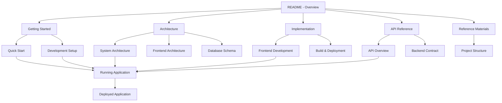

# MNFST RAG Admin Dashboard - Complete Documentation

Welcome to the comprehensive documentation for the MNFST RAG Admin Dashboard. This is a simplified multi-tenant MNFST RAG SaaS solution with three user roles and complete data isolation.

## 🎯 What This Is

A streamlined multi-tenant MNFST RAG SaaS solution with three user roles:
- **Superadmin**: Creates and manages tenants
- **Tenant Admin**: Manages documents, social media, and users for their tenant
- **User**: Accesses chatbot with tenant-specific knowledge base

Perfect for self-hosting with PostgreSQL database and compatible with various backend frameworks including FastAPI.

## 📚 Documentation Structure

### 🚀 Getting Started
- **[Quick Start Guide](./docs/getting-started/quick-start.md)** - Fast track to running the application
- **[Development Setup](./docs/getting-started/development-setup.md)** - Complete environment setup

### 🏗️ Architecture & Design
- **[System Architecture](./docs/architecture/system-architecture.md)** - High-level system design and multi-tenant architecture
- **[Frontend Architecture](./docs/architecture/frontend-architecture.md)** - React frontend architecture and patterns
- **[Database Schema](./docs/multi-tenant/database-schema.md)** - Database structure, types, and relationships

### 🛠️ Implementation Guides
- **[Frontend Development](./docs/implementation/frontend-development.md)** - React development patterns and best practices
- **[Build & Deployment](./docs/implementation/build-deployment.md)** - Build system and deployment workflows

### 📡 API Reference
- **[API Overview](./docs/api/overview.md)** - Complete API reference and authentication
- **[Backend Contract](./docs/api/backend-contract.md)** - Backend integration requirements

### 📋 Reference Materials
- **[Project Structure](./docs/reference/project-structure.md)** - Complete file organization and structure

## 🚀 Quick Start by Role

### 👨‍💻 New Developers
1. **Read [Quick Start Guide](./docs/getting-started/quick-start.md)** - Get running in 10 minutes
2. **Follow [Development Setup](./docs/getting-started/development-setup.md)** - Set up your environment
3. **Study [Frontend Architecture](./docs/architecture/frontend-architecture.md)** - Understand the frontend
4. **Check [API Overview](./docs/api/overview.md)** - Learn API integration

### 🏢 SaaS Implementers
1. **Start with [System Architecture](./docs/architecture/system-architecture.md)** - Understand the base system
2. **Read [Database Schema](./docs/multi-tenant/database-schema.md)** - Learn data relationships
3. **Review [API Overview](./docs/api/overview.md)** - Understand multi-tenant API design
4. **Follow [Build & Deployment](./docs/implementation/build-deployment.md)** - Deploy to production

### 🧭 DevOps Engineers
1. **Review [System Architecture](./docs/architecture/system-architecture.md)** - Understand system architecture
2. **Read [Build & Deployment](./docs/implementation/build-deployment.md)** - Learn deployment architecture
3. **Check [API Overview](./docs/api/overview.md)** - Understand API endpoints and security
4. **Follow [Development Setup](./docs/getting-started/development-setup.md)** - Set up development environment

### 📊 Project Managers
1. **Read this README** - Get overview of documentation structure
2. **Review [System Architecture](./docs/architecture/system-architecture.md)** - Understand system capabilities
3. **Check [Database Schema](./docs/multi-tenant/database-schema.md)** - Learn about data model

## 🎯 Key Features

### 💬 Chat Functionality (Default Section)
- Real-time chat with streaming responses
- Session management and history
- Tenant-specific knowledge base integration
- Message threading and organization
- Default landing page after login

### 📄 Document Management
- File upload with progress tracking
- Multiple file upload support
- Document processing and indexing
- Tenant-isolated storage
- Available to Tenant Admin and Superadmin roles

### 🔗 Social Media Integration
- Add social media links for knowledge base
- Support for major platforms (Twitter, Facebook, LinkedIn, etc.)
- Tenant-specific social media management
- Available to Tenant Admin and Superadmin roles

### 👥 User Management
- Three-role authentication system
- Role-based access control
- Tenant-specific user management
- Simple JWT-based authentication
- User management available to Admin+ roles

### 🏢 Multi-Tenant Support
- Complete data isolation between tenants
- Tenant creation and management (Superadmin only)
- Row-level security in database
- Self-hosted deployment ready

## 🛠️ Technology Stack

### Frontend
- **React 18** with TypeScript
- **Tailwind CSS** for styling
- **Vite** for fast development
- **React Router** for navigation

### Backend (Compatible Options)
- **FastAPI** (Python) - Recommended
- **Node.js** with TypeScript
- **Express.js** framework
- **JWT** for authentication

### Database
- **PostgreSQL** with pgvector extension
- Compatible with any PostgreSQL hosting solution
- Row-level security for multi-tenant isolation

### Infrastructure
- Compatible with any hosting provider
- Simple deployment without complex orchestration

## 🚀 Quick Deployment

### Self-Hosted Deployment
```bash
# 1. Build application
npm run build

# 2. Deploy to your hosting provider
# Upload build files to your hosting
# Configure environment variables
# Set up domain and SSL
```

### Environment Configuration
```env
# Database
DATABASE_URL=postgresql://[your-postgres-connection]

# Authentication
JWT_ACCESS_SECRET=[jwt-secret]
JWT_REFRESH_SECRET=[refresh-secret]

# Application
NODE_ENV=production
PORT=3000
```

## 📋 Project Status

### ✅ Completed Features
- [x] Simplified multi-tenant architecture
- [x] Three-role authentication system
- [x] Basic tenant data isolation
- [x] Essential CRUD operations
- [x] Self-hosted deployment ready
- [x] Comprehensive documentation

### 🔄 In Progress
- [ ] Implementation of simplified system
- [ ] Migration from complex to simple
- [ ] Testing and validation

## 🤝 Contributing

We welcome contributions to improve the simplified multi-tenant system!

## 📞 Getting Help

### 📚 Documentation First
1. Check this README for relevant links
2. Search specific documentation for your topic
3. Review the appropriate guide for your role

### 🐛 Issue Reporting
1. Check existing issues for duplicates
2. Use issue templates when creating new issues
3. Include detailed reproduction steps

### 💬 Community Support
1. Join our Discord community
2. Participate in GitHub discussions
3. Ask questions in appropriate channels

## 🔗 External Links

- **Main Repository**: [github.com/your-org/mnfst-rag](https://github.com/your-org/mnfst-rag)
- **Issue Tracker**: [github.com/your-org/mnfst-rag/issues](https://github.com/your-org/mnfst-rag/issues)
- **Discord Community**: [discord.gg/rag-chat](https://discord.gg/rag-chat)

## 📄 License

This project is licensed under the MIT License - see the [LICENSE](../LICENSE) file for details.

---

**Last Updated**: November 2024  
**Version**: 2.0.0 (Simplified)  
**Maintainers**: MNFST RAG Development Team

## 📖 Documentation Summary

| Category | Document | Purpose | Key Content |
|----------|----------|---------|-------------|
| **Getting Started** | [Quick Start](./docs/getting-started/quick-start.md) | Fast track to running | Setup in 10 minutes |
| | [Development Setup](./docs/getting-started/development-setup.md) | Environment setup | Complete development environment |
| **Architecture** | [System Architecture](./docs/architecture/system-architecture.md) | System Design | Multi-tenant architecture, security, data flow |
| | [Frontend Architecture](./docs/architecture/frontend-architecture.md) | Frontend Design | React patterns, component hierarchy |
| | [Database Schema](./docs/multi-tenant/database-schema.md) | Data Model | Schema, types, relationships, migrations |
| **Implementation** | [Frontend Development](./docs/implementation/frontend-development.md) | React Development | Patterns, best practices, examples |
| | [Build & Deployment](./docs/implementation/build-deployment.md) | Production | Build process, deployment, CI/CD |
| **API Reference** | [API Overview](./docs/api/overview.md) | API Reference | All endpoints, authentication, examples |
| | [Backend Contract](./docs/api/backend-contract.md) | Backend Requirements | Integration requirements, contracts |
| **Reference** | [Project Structure](./docs/reference/project-structure.md) | File Organization | Complete file structure and organization |

### 🎯 Documentation Navigation



This unified documentation structure provides all essential information organized by theme and purpose, making it easier to understand, implement, and deploy the MNFST RAG multi-tenant system.