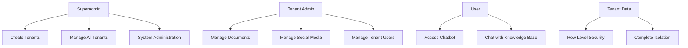

# MNFST RAG Admin Dashboard - Simplified Multi-Tenant

A simplified multi-tenant MNFST RAG SaaS solution built with React, TypeScript, and Supabase. Perfect for self-hosting on Hostinger.

## 🎯 What This Is

A streamlined multi-tenant MNFST RAG system with three user roles:
- **Superadmin**: Creates and manages tenants
- **Tenant Admin**: Manages documents, social media, and users for their tenant  
- **User**: Accesses chatbot with tenant-specific knowledge base

**Key Features:**
- ✅ Simple 3-role authentication system
- ✅ Tenant data isolation with row-level security
- ✅ Document upload and management
- ✅ Social media integration for knowledge base
- ✅ Real-time chat with streaming responses
- ✅ Self-hosted deployment ready
- ✅ Supabase database integration

## 🚀 Quick Start

### Prerequisites
- Node.js 18+ 
- Supabase account
- Hostinger hosting account (optional)

### Installation

```bash
# Clone repository
git clone https://github.com/your-org/mnfst-rag.git
cd mnfst-rag

# Install dependencies
npm install

# Set up environment variables
cp .env.example .env
# Edit .env with your Supabase credentials

# Start development server
npm run dev
```

### Environment Setup

```env
# Supabase Configuration
VITE_SUPABASE_URL=https://your-project.supabase.co
VITE_SUPABASE_ANON_KEY=your-anon-key

# API Configuration
VITE_API_URL=http://localhost:3001/api/v1
VITE_APP_NAME=MNFST RAG Dashboard
```

## 📚 Documentation

### 🚀 Getting Started
- **[Documentation Overview](./docs/README.md)** - Complete documentation hub
- **[Development Guide](./docs/DEVELOPMENT.md)** - Setup, patterns, testing, and tools

### 🏗️ Core Architecture
- **[Architecture Guide](./docs/ARCHITECTURE.md)** - System design, multi-tenant architecture, security
- **[Database Schema](./docs/DATABASE.md)** - Database structure, types, and relationships

### 📡 API & Integration
- **[API Reference](./docs/API.md)** - Complete API reference with authentication and endpoints

### 🚀 Deployment
- **[Deployment Guide](./docs/DEPLOYMENT.md)** - Production deployment on Hostinger with Supabase

## 🏗️ System Architecture

### User Roles & Access



### Technology Stack

**Frontend:**
- React 18 with TypeScript
- Tailwind CSS for styling
- Vite for fast development
- React Router for navigation

**Backend:**
- Node.js with Express
- Supabase for database and auth
- JWT for session management
- PostgreSQL with pgvector

**Infrastructure:**
- Hostinger for hosting
- Supabase for managed database
- Simple deployment without complex orchestration

## 🎯 Key Features

### 💬 Chat System
- Real-time chat with streaming responses
- Session management and history
- Tenant-specific knowledge base
- Message threading and organization

### 📄 Document Management
- File upload with progress tracking
- Multiple file upload support
- Document processing and indexing
- Tenant-isolated storage

### 🔗 Social Media Integration
- Add social media links for knowledge base
- Support for major platforms (Twitter, Facebook, LinkedIn, etc.)
- Tenant-specific management

### 👥 User Management
- Three-role authentication system
- Role-based access control
- Tenant-specific user management
- Simple JWT-based authentication

### 🏢 Multi-Tenant Support
- Complete data isolation between tenants
- Tenant creation and management
- Row-level security in database
- Self-hosted deployment ready

## 🚀 Deployment

### Self-Hosted on Hostinger

```bash
# 1. Build application
npm run build

# 2. Deploy to Hostinger
# Upload build files to Hostinger hosting
# Configure environment variables
# Set up domain and SSL
```

### Supabase Setup

1. **Create Supabase Project**
   - Go to [supabase.com](https://supabase.com)
   - Create new project
   - Get project URL and keys

2. **Set Up Database**
   - Run schema from [Database Schema](./docs/DATABASE.md)
   - Enable row level security
   - Create necessary indexes

3. **Configure Authentication**
   - Enable JWT authentication
   - Set up auth providers
   - Configure redirect URLs

## 📋 Project Status

### ✅ Completed
- [x] Simplified multi-tenant architecture
- [x] Three-role authentication system
- [x] Basic tenant data isolation
- [x] Essential CRUD operations
- [x] Self-hosted deployment ready
- [x] Comprehensive documentation

### 🔄 In Progress
- [ ] Implementation of simplified system
- [ ] Migration from complex to simple
- [ ] Testing and validation

## 🛠️ Development

### Available Scripts

```bash
# Start development server
npm run dev

# Build for production
npm run build

# Preview production build
npm run preview

# Run tests
npm test

# Run linting
npm run lint

# Type checking
npm run type-check
```

### Project Structure

```
src/
├── components/          # Reusable UI components
│   ├── auth/          # Authentication components
│   ├── layout/        # Layout components
│   └── ui/            # Base UI components
├── context/           # React contexts
├── pages/             # Page components
│   ├── ChatPage.tsx    # Default page after login
│   ├── DocumentsPage.tsx
│   ├── SocialPage.tsx
│   ├── TenantsPage.tsx
│   ├── UsersPage.tsx
│   └── SettingsPage.tsx
├── services/          # API services
│   └── mock/          # Mock API for development
├── types/             # TypeScript type definitions
└── styles/            # Global styles
```

## 🤝 Contributing

We welcome contributions! Please see our [Development Guide](./docs/DEVELOPMENT.md) for:
- Development workflow
- Code standards
- Testing requirements
- Documentation guidelines

## 📞 Getting Help

### 📚 Documentation First
1. Check [Documentation Overview](./docs/README.md) for complete guides
2. Search specific documentation for your topic
3. Review the appropriate guide for your role

### 🐛 Issue Reporting
1. Check existing issues for duplicates
2. Use issue templates when creating new issues
3. Include detailed reproduction steps

### 💬 Community Support
1. Join our Discord community
2. Participate in GitHub discussions
3. Ask questions in appropriate channels

## 🔗 Links

- **Documentation**: [docs/README.md](./docs/README.md)
- **API Reference**: [docs/API.md](./docs/API.md)
- **Architecture Guide**: [docs/ARCHITECTURE.md](./docs/ARCHITECTURE.md)
- **Development Guide**: [docs/DEVELOPMENT.md](./docs/DEVELOPMENT.md)
- **Database Schema**: [docs/DATABASE.md](./docs/DATABASE.md)
- **Deployment Guide**: [docs/DEPLOYMENT.md](./docs/DEPLOYMENT.md)
- **Main Repository**: [github.com/your-org/mnfst-rag](https://github.com/your-org/mnfst-rag)
- **Issue Tracker**: [github.com/your-org/mnfst-rag/issues](https://github.com/your-org/mnfst-rag/issues)

## 📄 License

This project is licensed under the MIT License - see the [LICENSE](LICENSE) file for details.

---

**Last Updated**: November 2024  
**Version**: 2.0.0 (Simplified)  
**Maintainers**: MNFST RAG Development Team