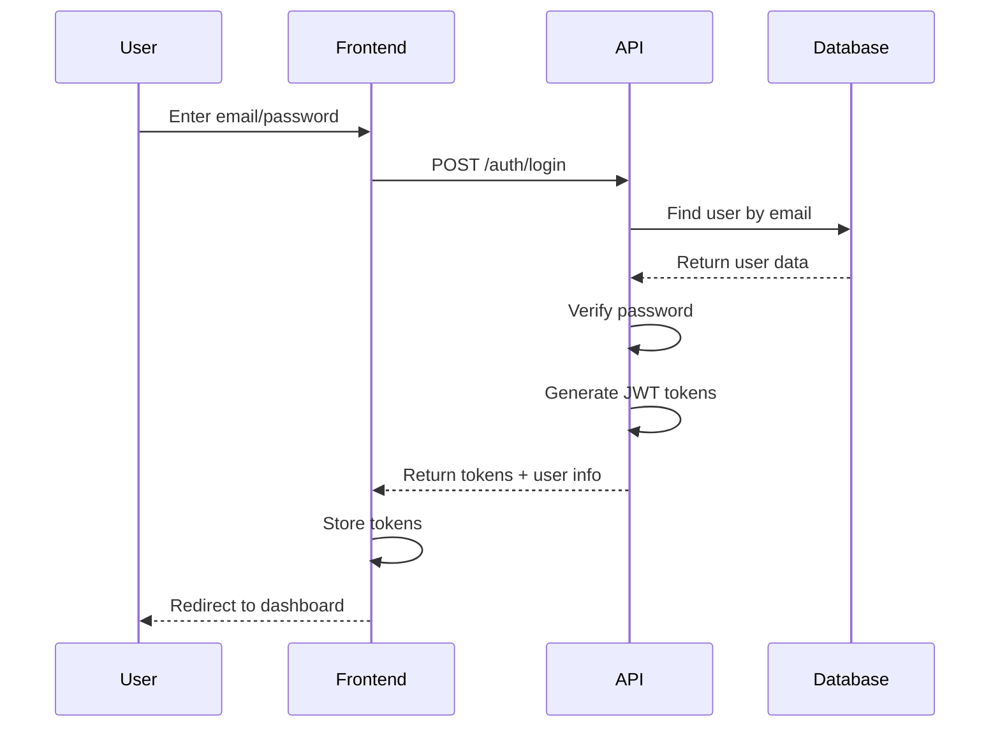

# API Reference & Authentication

Complete guide to the RAG Chat API with three-role authentication, endpoint documentation, and authentication system.

## 📋 API Basics

### Base URL

```
Development: http://localhost:3001/api
Production: https://yourdomain.com/api
```

### Authentication

The API uses JWT (JSON Web Token) authentication:

```http
Authorization: Bearer <your-jwt-token>
```

### Content Type

All requests should use JSON content type:

```http
Content-Type: application/json
```

### API Versioning

The API is versioned using URL paths:

```
/api/v1/...
```

## 🔐 Authentication System

### User Roles

The system uses a three-role authentication model:

1. **Superadmin**: Creates and manages all tenants
2. **Tenant Admin**: Manages users, documents, and social links for their tenant
3. **User**: Accesses chat functionality for their tenant

### Authentication Flow



### JWT Token Structure

#### Access Token Payload

```typescript
interface AccessTokenPayload {
  sub: string;          // User ID
  role: 'superadmin' | 'tenant_admin' | 'user';
  tenantId?: string;    // Tenant ID (null for superadmin)
  email: string;
  name: string;
  iat: number;         // Issued at
  exp: number;         // Expires at
  iss: string;         // Issuer
  aud: string;         // Audience
}
```

#### Refresh Token Payload

```typescript
interface RefreshTokenPayload {
  sub: string;          // User ID
  tenantId?: string;    // Tenant ID (null for superadmin)
  iat: number;         // Issued at
  exp: number;         // Expires at (7 days)
}
```

## 🔑 Authentication Endpoints

### Login

```http
POST /api/v1/auth/login
Content-Type: application/json

{
  "email": "user@example.com",
  "password": "password"
}
```

**Response:**
```json
{
  "success": true,
  "data": {
    "user": {
      "id": "user_123",
      "email": "user@example.com",
      "name": "John Doe",
      "role": "tenant_admin",
      "tenantId": "tenant_456"
    },
    "tokens": {
      "accessToken": "eyJhbGciOiJIUzI1NiIsInR5cCI6IkpXVCJ9...",
      "refreshToken": "eyJhbGciOiJIUzI1NiIsInR5cCI6IkpXVCJ9...",
      "expiresIn": 900
    }
  }
}
```

### Refresh Token

```http
POST /api/v1/auth/refresh
Content-Type: application/json

{
  "refreshToken": "eyJhbGciOiJIUzI1NiIsInR5cCI6IkpXVCJ9..."
}
```

**Response:**
```json
{
  "success": true,
  "data": {
    "accessToken": "eyJhbGciOiJIUzI1NiIsInR5cCI6IkpXVCJ9...",
    "expiresIn": 900
  }
}
```

### Logout

```http
POST /api/v1/auth/logout
Authorization: Bearer <access-token>
```

**Response:**
```json
{
  "success": true,
  "message": "Logged out successfully"
}
```

### Get Current User

```http
GET /api/v1/auth/me
Authorization: Bearer <access-token>
```

**Response:**
```json
{
  "success": true,
  "data": {
    "id": "user_123",
    "email": "user@example.com",
    "name": "John Doe",
    "role": "tenant_admin",
    "tenantId": "tenant_456"
  }
}
```

## 🏢 Tenant Management (Superadmin Only)

### Create Tenant

```http
POST /api/v1/tenants
Authorization: Bearer <superadmin-token>
Content-Type: application/json

{
  "name": "Acme Corporation",
  "slug": "acme-corp",
  "adminUser": {
    "email": "admin@acme.com",
    "password": "securePassword123",
    "name": "John Admin"
  }
}
```

**Response:**
```json
{
  "success": true,
  "data": {
    "id": "tenant_456",
    "name": "Acme Corporation",
    "slug": "acme-corp",
    "createdAt": "2024-01-01T10:00:00Z",
    "adminUser": {
      "id": "user_789",
      "email": "admin@acme.com",
      "name": "John Admin",
      "role": "tenant_admin"
    }
  }
}
```

### Get All Tenants

```http
GET /api/v1/tenants
Authorization: Bearer <superadmin-token>
```

**Response:**
```json
{
  "success": true,
  "data": [
    {
      "id": "tenant_456",
      "name": "Acme Corporation",
      "slug": "acme-corp",
      "createdAt": "2024-01-01T10:00:00Z",
      "userCount": 5,
      "documentCount": 12
    }
  ]
}
```

### Update Tenant

```http
PUT /api/v1/tenants/{tenantId}
Authorization: Bearer <superadmin-token>
Content-Type: application/json

{
  "name": "Updated Company Name"
}
```

**Response:**
```json
{
  "success": true,
  "data": {
    "id": "tenant_456",
    "name": "Updated Company Name",
    "slug": "acme-corp",
    "updatedAt": "2024-01-01T11:00:00Z"
  }
}
```

### Delete Tenant

```http
DELETE /api/v1/tenants/{tenantId}
Authorization: Bearer <superadmin-token>
```

**Response:**
```json
{
  "success": true,
  "message": "Tenant deleted successfully"
}
```

## 👥 User Management

### Create User (Tenant Admin Only)

```http
POST /api/v1/users
Authorization: Bearer <tenant-admin-token>
Content-Type: application/json

{
  "email": "user@company.com",
  "name": "Jane User",
  "password": "userPassword123",
  "role": "user"
}
```

**Response:**
```json
{
  "success": true,
  "data": {
    "id": "user_123",
    "email": "user@company.com",
    "name": "Jane User",
    "role": "user",
    "tenantId": "tenant_456",
    "createdAt": "2024-01-01T10:00:00Z"
  }
}
```

### Get Users (Tenant Admin Only)

```http
GET /api/v1/users
Authorization: Bearer <tenant-admin-token>
```

**Response:**
```json
{
  "success": true,
  "data": [
    {
      "id": "user_123",
      "email": "user@company.com",
      "name": "Jane User",
      "role": "user",
      "createdAt": "2024-01-01T10:00:00Z",
      "lastLogin": "2024-01-01T09:30:00Z"
    }
  ]
}
```

### Update User (Tenant Admin Only)

```http
PUT /api/v1/users/{userId}
Authorization: Bearer <tenant-admin-token>
Content-Type: application/json

{
  "name": "Updated Name",
  "role": "user"
}
```

**Response:**
```json
{
  "success": true,
  "data": {
    "id": "user_123",
    "email": "user@company.com",
    "name": "Updated Name",
    "role": "user",
    "updatedAt": "2024-01-01T11:00:00Z"
  }
}
```

### Delete User (Tenant Admin Only)

```http
DELETE /api/v1/users/{userId}
Authorization: Bearer <tenant-admin-token>
```

**Response:**
```json
{
  "success": true,
  "message": "User deleted successfully"
}
```

## 📄 Document Management (Tenant Admin Only)

### Get Documents

```http
GET /api/v1/documents
Authorization: Bearer <tenant-admin-token>
```

**Response:**
```json
{
  "success": true,
  "data": [
    {
      "id": "doc_1",
      "filename": "research-paper.pdf",
      "originalName": "research-paper.pdf",
      "size": 2048576,
      "fileType": "application/pdf",
      "status": "processed",
      "uploadedAt": "2024-01-01T09:00:00Z",
      "processedAt": "2024-01-01T09:05:00Z"
    }
  ]
}
```

### Upload Document

```http
POST /api/v1/documents/upload
Authorization: Bearer <tenant-admin-token>
Content-Type: multipart/form-data

file: <binary-data>
```

**Response:**
```json
{
  "success": true,
  "data": {
    "id": "doc_3",
    "filename": "document_123456.pdf",
    "originalName": "my-document.pdf",
    "size": 1024000,
    "fileType": "application/pdf",
    "status": "uploaded",
    "uploadedAt": "2024-01-01T11:00:00Z"
  }
}
```

### Upload Multiple Documents

```http
POST /api/v1/documents/upload-multiple
Authorization: Bearer <tenant-admin-token>
Content-Type: multipart/form-data

files: [<binary-data-1>, <binary-data-2>]
```

**Response:**
```json
{
  "success": true,
  "data": {
    "uploadId": "upload_123",
    "documents": [
      {
        "id": "doc_4",
        "filename": "file1_123456.pdf",
        "originalName": "file1.pdf",
        "status": "uploaded"
      },
      {
        "id": "doc_5",
        "filename": "file2_123456.pdf",
        "originalName": "file2.pdf",
        "status": "uploaded"
      }
    ]
  }
}
```

### Delete Document

```http
DELETE /api/v1/documents/{documentId}
Authorization: Bearer <tenant-admin-token>
```

**Response:**
```json
{
  "success": true,
  "message": "Document deleted successfully"
}
```

## 🔗 Social Media Management (Tenant Admin Only)

### Get Social Links

```http
GET /api/v1/social-links
Authorization: Bearer <tenant-admin-token>
```

**Response:**
```json
{
  "success": true,
  "data": [
    {
      "id": "social_1",
      "url": "https://twitter.com/example",
      "platform": "twitter",
      "createdAt": "2024-01-01T09:00:00Z"
    }
  ]
}
```

### Add Social Link

```http
POST /api/v1/social-links
Authorization: Bearer <tenant-admin-token>
Content-Type: application/json

{
  "url": "https://github.com/example"
}
```

**Response:**
```json
{
  "success": true,
  "data": {
    "id": "social_3",
    "url": "https://github.com/example",
    "platform": "github",
    "createdAt": "2024-01-01T11:00:00Z"
  }
}
```

### Delete Social Link

```http
DELETE /api/v1/social-links/{linkId}
Authorization: Bearer <tenant-admin-token>
```

**Response:**
```json
{
  "success": true,
  "message": "Social link deleted successfully"
}
```

## 💬 Chat Functionality (All Authenticated Users)

### Get Chat Sessions

```http
GET /api/v1/sessions
Authorization: Bearer <access-token>
```

**Response:**
```json
{
  "success": true,
  "data": [
    {
      "id": "session_1",
      "title": "Getting Started with RAG",
      "createdAt": "2024-01-01T10:00:00Z",
      "updatedAt": "2024-01-01T10:30:00Z",
      "messageCount": 12
    }
  ]
}
```

### Create Chat Session

```http
POST /api/v1/sessions
Authorization: Bearer <access-token>
Content-Type: application/json

{
  "title": "New Chat Session"
}
```

**Response:**
```json
{
  "success": true,
  "data": {
    "id": "session_3",
    "title": "New Chat Session",
    "createdAt": "2024-01-01T11:00:00Z",
    "updatedAt": "2024-01-01T11:00:00Z",
    "messageCount": 0
  }
}
```

### Get Chat Messages

```http
GET /api/v1/sessions/{sessionId}/messages
Authorization: Bearer <access-token>
```

**Response:**
```json
{
  "success": true,
  "data": [
    {
      "id": "msg_1",
      "content": "What is RAG?",
      "role": "user",
      "timestamp": "2024-01-01T11:00:00Z"
    },
    {
      "id": "msg_2",
      "content": "RAG stands for Retrieval-Augmented Generation...",
      "role": "assistant",
      "timestamp": "2024-01-01T11:00:05Z"
    }
  ]
}
```

### Send Message

```http
POST /api/v1/sessions/{sessionId}/messages
Authorization: Bearer <access-token>
Content-Type: application/json

{
  "content": "What is RAG?",
  "role": "user"
}
```

**Response:**
```json
{
  "success": true,
  "data": {
    "id": "msg_123",
    "sessionId": "session_1",
    "content": "What is RAG?",
    "role": "user",
    "timestamp": "2024-01-01T11:00:00Z"
  }
}
```

### Send Message (Streaming)

```http
POST /api/v1/sessions/{sessionId}/messages/stream
Authorization: Bearer <access-token>
Content-Type: application/json

{
  "content": "Explain quantum computing",
  "role": "user"
}
```

**Streaming Response:**
```
data: {"type": "start", "messageId": "msg_124"}
data: {"type": "token", "content": "Quantum computing "}
data: {"type": "token", "content": "is a revolutionary "}
data: {"type": "token", "content": "approach to processing "}
data: {"type": "end", "messageId": "msg_124"}
```

### Delete Chat Session

```http
DELETE /api/v1/sessions/{sessionId}
Authorization: Bearer <access-token>
```

**Response:**
```json
{
  "success": true,
  "message": "Chat session deleted successfully"
}
```

## 📊 Response Format

### Success Response

```json
{
  "success": true,
  "data": {
    // Response data here
  },
  "meta": {
    "timestamp": "2024-01-01T00:00:00Z",
    "requestId": "req_123"
  }
}
```

### Error Response

```json
{
  "success": false,
  "error": {
    "code": "ERROR_CODE",
    "message": "Human-readable error message",
    "details": "Additional error details"
  },
  "meta": {
    "timestamp": "2024-01-01T00:00:00Z",
    "requestId": "req_123"
  }
}
```

## 🌐 HTTP Status Codes

### Success Codes
- `200 OK` - Request successful
- `201 Created` - Resource created successfully
- `204 No Content` - Request successful, no content returned

### Client Error Codes
- `400 Bad Request` - Invalid request data
- `401 Unauthorized` - Authentication required
- `403 Forbidden` - Insufficient permissions
- `404 Not Found` - Resource not found
- `422 Unprocessable Entity` - Validation error

### Server Error Codes
- `500 Internal Server Error` - Server error

## 🚨 Error Codes

| Code | Description | HTTP Status |
|------|-------------|-------------|
| `VALIDATION_ERROR` | Input validation failed | 422 |
| `AUTHENTICATION_FAILED` | Invalid credentials | 401 |
| `TOKEN_EXPIRED` | JWT token expired | 401 |
| `INSUFFICIENT_PERMISSIONS` | User lacks permission | 403 |
| `RESOURCE_NOT_FOUND` | Resource doesn't exist | 404 |
| `TENANT_NOT_FOUND` | Tenant doesn't exist | 404 |
| `USER_NOT_FOUND` | User doesn't exist | 404 |
| `INTERNAL_ERROR` | Server error | 500 |

## 🔧 Role-Based Access Control

### Permission System

The API uses a simple permission-based system:

#### Superadmin Permissions
- `tenants.create` - Create new tenants
- `tenants.read` - View all tenants
- `tenants.update` - Update tenant information
- `tenants.delete` - Delete tenants
- `users.read` - View all users across all tenants

#### Tenant Admin Permissions
- `users.create` - Create users within tenant
- `users.read` - View users within tenant
- `users.update` - Update users within tenant
- `users.delete` - Delete users within tenant
- `documents.create` - Upload documents
- `documents.read` - View documents
- `documents.delete` - Delete documents
- `social_links.create` - Add social media links
- `social_links.read` - View social media links
- `social_links.delete` - Delete social media links
- `chat.read` - Access chat interface

#### User Permissions
- `chat.create` - Create chat sessions
- `chat.read` - View chat sessions and messages

### Authentication Middleware

```typescript
// Simple middleware for tenant context
const tenantContext = async (req: Request, res: Response, next: NextFunction) => {
  try {
    // 1. Extract and verify token
    const token = extractToken(req);
    const decoded = jwt.verify(token, process.env.JWT_SECRET) as any;
    
    // 2. Get user
    const user = await getUser(decoded.userId);
    if (!user) {
      return res.status(401).json({
        success: false,
        error: {
          code: 'USER_NOT_FOUND',
          message: 'User not found'
        }
      });
    }
    
    // 3. Set user and tenant context
    req.user = user;
    req.tenantId = user.tenant_id;
    
    // 4. Set database context for RLS
    if (user.tenant_id) {
      await setDatabaseContext('app.current_tenant_id', user.tenant_id);
    }
    
    next();
  } catch (error) {
    return res.status(401).json({
      success: false,
      error: {
        code: 'AUTHENTICATION_FAILED',
        message: 'Invalid authentication'
      }
    });
  }
};
```

## 🧪 Mock API

### Enable Mock API

Set environment variable in `.env`:

```env
VITE_USE_MOCK_API=true
```

### Mock Credentials

#### Superadmin
- Email: `superadmin@ragchat.com`
- Password: `admin123`

#### Tenant Admin
- Email: `admin@tenant.com`
- Password: `admin123`

#### User
- Email: `user@tenant.com`
- Password: `user123`

### Mock API Features

- Realistic network delays (500-2000ms)
- Consistent in-memory data storage
- Role-based access control
- Tenant data isolation
- File upload simulation
- Streaming response simulation

### Mock API Configuration

```env
# Network Simulation
VITE_MOCK_DELAY_MIN=500
VITE_MOCK_DELAY_MAX=2000
VITE_MOCK_ERROR_RATE=0.1

# Data Generation
VITE_MOCK_DATA_SEED=12345
VITE_MOCK_REALISTIC_DATA=true
VITE_MOCK_CONSISTENT_DATA=true
```

## 🔒 Security Considerations

### Token Management

1. **Access Tokens**: 15-minute expiration
2. **Refresh Tokens**: 7-day expiration
3. **Token Storage**: Store in httpOnly cookies or secure localStorage
4. **Token Refresh**: Automatic refresh on access token expiry

### Password Security

1. **Hashing**: Use bcrypt with salt rounds >= 12
2. **Validation**: Enforce strong password policies
3. **Reset**: Secure password reset flow

### API Security

1. **HTTPS**: Always use HTTPS in production
2. **CORS**: Configure appropriate CORS policies
3. **Rate Limiting**: Basic rate limiting per endpoint
4. **Input Validation**: Validate all input data
5. **SQL Injection**: Use parameterized queries

---

**Related Documentation**:
- [Architecture Guide](./ARCHITECTURE.md) - System architecture and design
- [Database Schema](./DATABASE.md) - Database structure and types
- [Development Guide](./DEVELOPMENT.md) - Development setup and patterns
- [Deployment Guide](./DEPLOYMENT.md) - Deployment instructions