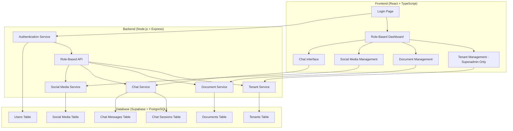
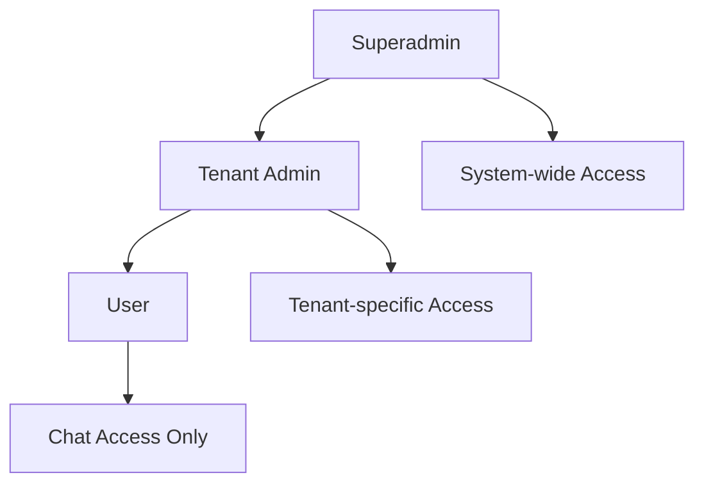
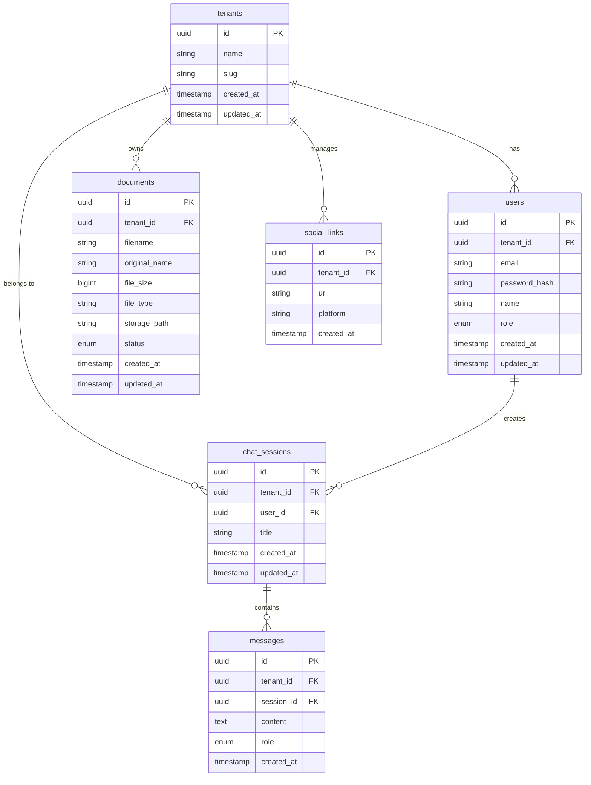
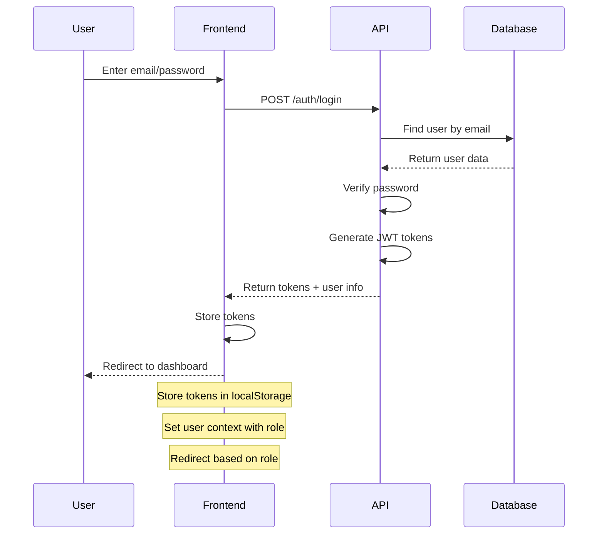
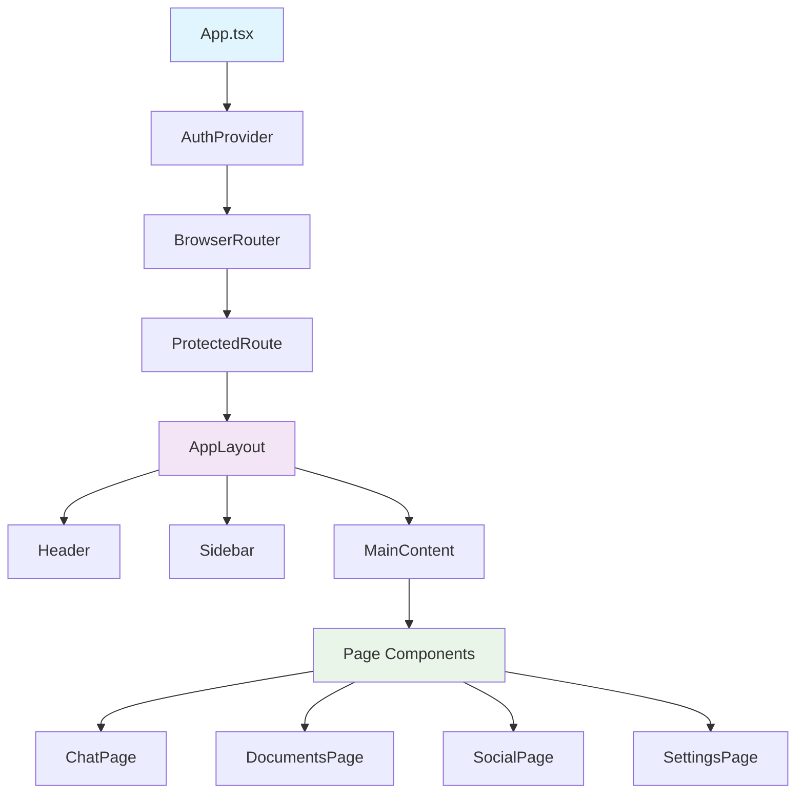
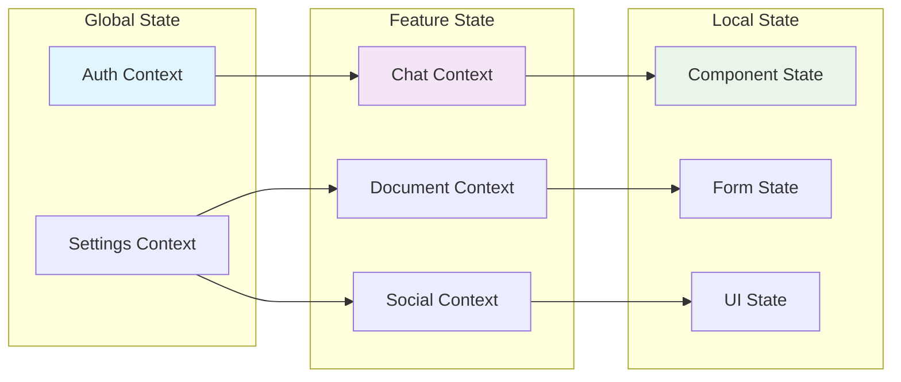
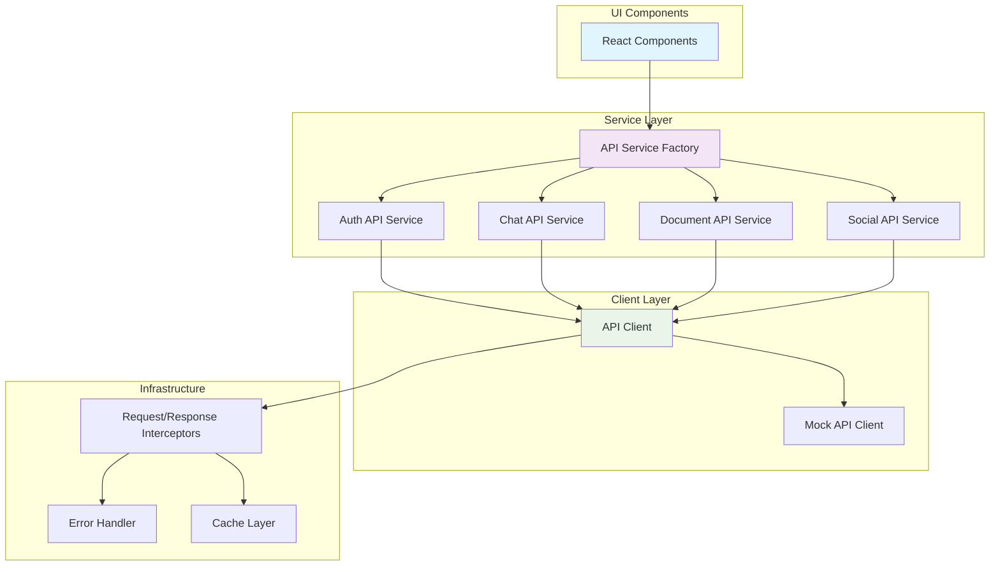
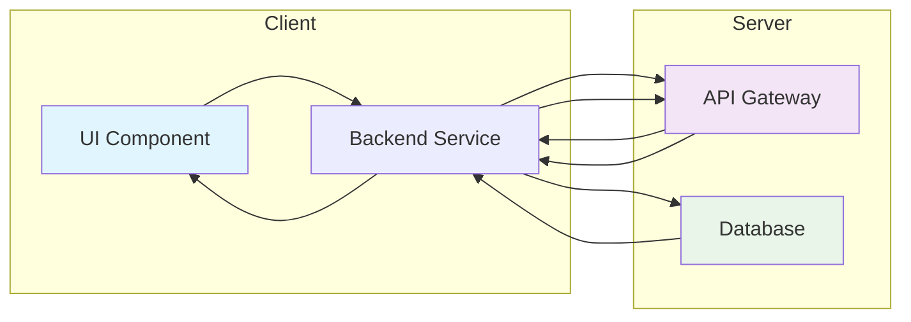
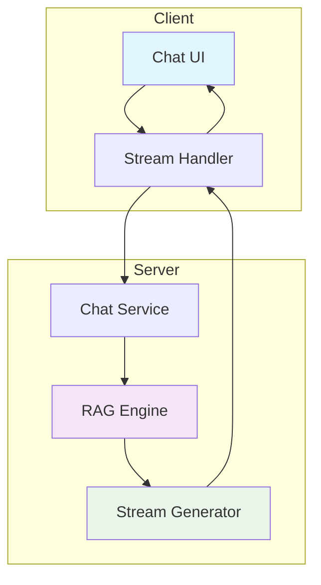
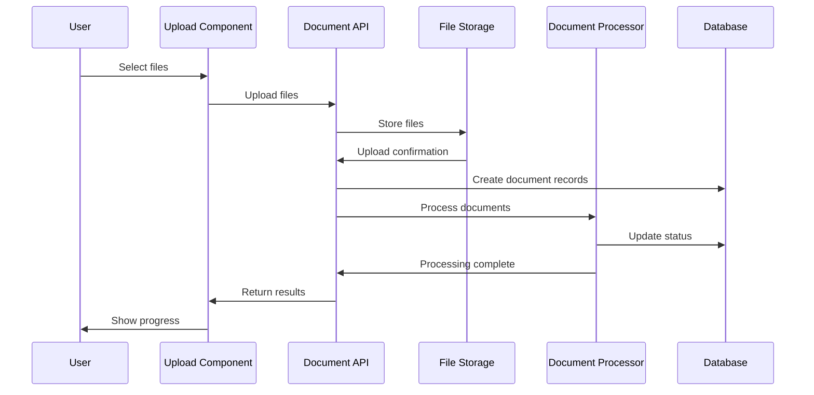

# Architecture Guide

Comprehensive overview of the RAG Chat Admin Dashboard system architecture, including multi-tenant design, components, data flow, and security.

## 🏗️ High-Level Architecture

The simplified multi-tenant RAG Chat system enables SaaS deployment with three user roles and complete data isolation.



## 👥 User Roles & Permissions

### Three-Role System

| Role | Description | Key Permissions |
|------|-------------|-----------------|
| **Superadmin** | Creates and manages all tenants | `tenants.*`, `users.read` |
| **Tenant Admin** | Manages tenant resources | `users.*`, `documents.*`, `social_links.*`, `chat.read` |
| **User** | Uses chat functionality | `chat.*` |

### Role Hierarchy



### Permission Matrix

| Feature | Superadmin | Tenant Admin | User |
|---------|------------|--------------|------|
| Create/Manage Tenants | ✅ | ❌ | ❌ |
| Manage Tenant Users | ✅ | ✅ (own tenant) | ❌ |
| Upload/Manage Documents | ✅ | ✅ (own tenant) | ❌ |
| Manage Social Links | ✅ | ✅ (own tenant) | ❌ |
| Access Chat Interface | ✅ | ✅ (own tenant) | ✅ (own tenant) |
| View System Analytics | ✅ | ❌ | ❌ |

## 🗄️ Multi-Tenant Data Architecture

### Database Schema Overview



### Data Isolation Strategy

1. **Tenant ID Column**: Every tenant-specific table has a `tenant_id` column
2. **Row-Level Security**: PostgreSQL RLS policies ensure users can only access their tenant's data
3. **Application Context**: Set tenant context in database session for each request

### Row-Level Security Policies

```sql
-- Enable RLS on tenant-specific tables
ALTER TABLE users ENABLE ROW LEVEL SECURITY;
ALTER TABLE chat_sessions ENABLE ROW LEVEL SECURITY;
ALTER TABLE messages ENABLE ROW LEVEL SECURITY;
ALTER TABLE documents ENABLE ROW LEVEL SECURITY;
ALTER TABLE social_links ENABLE ROW LEVEL SECURITY;

-- Users can only see users from their tenant (except superadmin)
CREATE POLICY tenant_isolation_users ON users
    FOR ALL TO authenticated
    USING (
        tenant_id = current_setting('app.current_tenant_id')::uuid 
        OR current_setting('app.user_role') = 'superadmin'
    );

-- Chat sessions isolation
CREATE POLICY tenant_isolation_sessions ON chat_sessions
    FOR ALL TO authenticated
    USING (tenant_id = current_setting('app.current_tenant_id')::uuid);

-- Messages isolation
CREATE POLICY tenant_isolation_messages ON messages
    FOR ALL TO authenticated
    USING (tenant_id = current_setting('app.current_tenant_id')::uuid);

-- Documents isolation
CREATE POLICY tenant_isolation_documents ON documents
    FOR ALL TO authenticated
    USING (tenant_id = current_setting('app.current_tenant_id')::uuid);

-- Social links isolation
CREATE POLICY tenant_isolation_social_links ON social_links
    FOR ALL TO authenticated
    USING (tenant_id = current_setting('app.current_tenant_id')::uuid);
```

## 🔐 Authentication & Authorization Flow

### Authentication Process



### JWT Token Structure

#### Access Token Payload
```typescript
interface AccessTokenPayload {
  sub: string;          // User ID
  role: 'superadmin' | 'tenant_admin' | 'user';
  tenantId?: string;    // Tenant ID (null for superadmin)
  email: string;
  name: string;
  iat: number;         // Issued at
  exp: number;         // Expires at
  iss: string;         // Issuer
  aud: string;         // Audience
}
```

#### Refresh Token Payload
```typescript
interface RefreshTokenPayload {
  sub: string;          // User ID
  tenantId?: string;    // Tenant ID (null for superadmin)
  iat: number;         // Issued at
  exp: number;         // Expires at (7 days)
}
```

### Role-Based Routing

```mermaid
graph TD
    A[Login] --> B{User Role}
    
    B -->|superadmin| C[/admin - Tenant Management]
    B -->|tenant_admin| D[/dashboard - Tenant Dashboard]
    B -->|user| E[/chat - Chat Interface]
    
    C --> F[Tenant CRUD]
    C --> G[System Settings]
    
    D --> H[Document Management]
    D --> I[Social Media Management]
    D --> J[User Management]
    D --> K[Chat Testing]
    
    E --> L[Chat Sessions]
    E --> M[Message History]
```

## 🎨 Frontend Architecture

### Component Hierarchy



### State Management Architecture



### Service Layer Architecture



## 🔄 Data Flow Patterns

### Request-Response Flow



### Streaming Data Flow



### File Upload Flow



## 🛡️ Security Architecture

### Authentication Middleware

```typescript
// Simple middleware for tenant context
const tenantContext = async (req: Request, res: Response, next: NextFunction) => {
  try {
    // 1. Extract and verify token
    const token = extractToken(req);
    const decoded = jwt.verify(token, process.env.JWT_SECRET) as any;
    
    // 2. Get user
    const user = await getUser(decoded.userId);
    if (!user) {
      return res.status(401).json({
        success: false,
        error: {
          code: 'USER_NOT_FOUND',
          message: 'User not found'
        }
      });
    }
    
    // 3. Set user and tenant context
    req.user = user;
    req.tenantId = user.tenant_id;
    
    // 4. Set database session context for RLS
    if (user.tenant_id) {
      await setDatabaseContext('app.current_tenant_id', user.tenant_id);
    }
    
    next();
  } catch (error) {
    return res.status(401).json({
      success: false,
      error: {
        code: 'AUTHENTICATION_FAILED',
        message: 'Invalid authentication'
      }
    });
  }
};
```

### Role-Based Authorization

```typescript
// Simple permission checking middleware
const requirePermission = (permission: string) => {
  return (req: Request, res: Response, next: NextFunction) => {
    const rbac = new SimpleRBAC();
    if (!rbac.hasPermission(req.user.role, permission)) {
      return res.status(403).json({
        success: false,
        error: {
          code: 'INSUFFICIENT_PERMISSIONS',
          message: 'You do not have permission to perform this action'
        }
      });
    }
    next();
  };
};
```

## 🚀 Deployment Architecture

### Self-Hosted on Hostinger

```
Hostinger Hosting
├── Static Files (React Build)
├── Environment Variables
├── Domain Configuration
└── SSL Certificate

Supabase (External)
├── PostgreSQL Database
├── Authentication Service
├── File Storage
└── Row Level Security
```

### Environment Configuration

```env
# Supabase Configuration
VITE_SUPABASE_URL=https://your-project.supabase.co
VITE_SUPABASE_ANON_KEY=your-anon-key

# Application Configuration
VITE_API_URL=https://your-domain.com
VITE_APP_NAME=RAG Chat Dashboard
```

## 📊 Technology Stack

### Frontend Technologies

| Layer | Technology | Purpose |
|-------|-------------|---------|
| **UI Framework** | React 18 | Component-based UI development |
| **Language** | TypeScript | Type safety and better development experience |
| **Styling** | Tailwind CSS | Utility-first CSS framework |
| **State Management** | React Context + useReducer | Global state management |
| **Routing** | React Router | Client-side routing |
| **HTTP Client** | Axios | HTTP requests with interceptors |
| **Build Tool** | Vite | Fast development and building |

### Backend Technologies

| Layer | Technology | Purpose |
|-------|-------------|---------|
| **API Framework** | Express.js | REST API development |
| **Authentication** | JWT + Passport | Authentication and authorization |
| **Database** | Supabase (PostgreSQL) | Relational data storage with RLS |
| **File Storage** | Supabase Storage | File storage and management |
| **RAG Engine** | LangChain / LlamaIndex | RAG processing pipeline |

### Infrastructure Technologies

| Layer | Technology | Purpose |
|-------|-------------|---------|
| **Hosting** | Hostinger | Application hosting |
| **Database** | Supabase | Managed PostgreSQL database |
| **Storage** | Supabase Storage | File storage service |
| **Process Manager** | PM2 | Node.js process management |

## 🎯 Design Decisions

### 1. Simplified Multi-Tenancy
**Decision**: Use shared database with tenant isolation
**Rationale**: 
- Cost-effective for small to medium deployments
- Easier maintenance and backups
- Sufficient security with RLS policies
- Simplified deployment on Hostinger

### 2. Three-Role Authentication
**Decision**: Fixed three roles instead of complex permissions
**Rationale**:
- Clear separation of responsibilities
- Easier to understand and implement
- Sufficient for most SaaS use cases
- Reduces complexity in UI and API

### 3. React Context for State Management
**Decision**: Use React Context instead of Redux/Zustand
**Rationale**:
- Built into React, no additional dependencies
- Simple and predictable data flow
- Good for medium-sized applications
- Easy to test and debug

### 4. Mock API System
**Decision**: Comprehensive mock API for development
**Rationale**:
- Enables frontend development without backend
- Consistent test data across scenarios
- Easy testing of edge cases
- Fast development iteration

---

**Related Documentation**:
- [Development Guide](./DEVELOPMENT.md) - Development setup and patterns
- [API Reference](./API.md) - Complete API documentation
- [Database Schema](./DATABASE.md) - Database structure and types
- [Deployment Guide](./DEPLOYMENT.md) - Deployment instructions