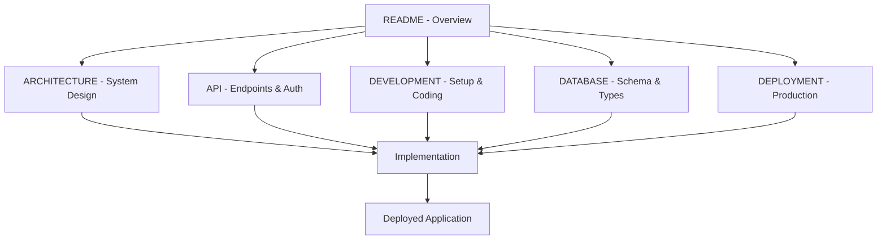

# RAG Chat Admin Dashboard - Simplified Multi-Tenant

Welcome to the **simplified** multi-tenant RAG Chat Admin Dashboard documentation. This system has been streamlined to focus on essential functionality without unnecessary complexity.

## 🎯 What This Is

A simplified multi-tenant RAG Chat SaaS solution with three user roles:
- **Superadmin**: Creates and manages tenants
- **Tenant Admin**: Manages documents, social media, and users for their tenant
- **User**: Accesses chatbot with tenant-specific knowledge base

Perfect for self-hosting on Hostinger with Supabase database.

## 📚 Documentation Structure

### 🚀 Getting Started
- **[DEVELOPMENT.md](./DEVELOPMENT.md)** - Complete setup, installation, and development guide
- **[DEPLOYMENT.md](./DEPLOYMENT.md)** - Production deployment on Hostinger with Supabase

### 🏗️ Core Architecture
- **[ARCHITECTURE.md](./ARCHITECTURE.md)** - **MAIN** system architecture, multi-tenant design, and security
- **[DATABASE.md](./DATABASE.md)** - Database schema, types, and data relationships

### 📡 API & Integration
- **[API.md](./API.md)** - **MAIN** complete API reference with authentication and endpoints

## 🚀 Quick Start for Different Roles

### 👨‍💻 New Developers
1. **Read [Development Guide](./DEVELOPMENT.md)** - Set up your development environment
2. **Follow [Architecture Guide](./ARCHITECTURE.md)** - Understand system design
3. **Check [API Reference](./API.md)** - Learn how to integrate with APIs
4. **Review [Database Schema](./DATABASE.md)** - Understand data structure

### 🏢 SaaS Implementers
1. **Start with [Architecture Guide](./ARCHITECTURE.md)** - Understand the base system
2. **Read [Database Schema](./DATABASE.md)** - Learn data relationships
3. **Review [API Reference](./API.md)** - Understand multi-tenant API design
4. **Follow [Deployment Guide](./DEPLOYMENT.md)** - Deploy to production

### 🧭 DevOps Engineers
1. **Review [Architecture Guide](./ARCHITECTURE.md)** - Understand system architecture
2. **Read [Deployment Guide](./DEPLOYMENT.md)** - Learn deployment architecture
3. **Check [API Reference](./API.md)** - Understand API endpoints and security
4. **Follow [Development Guide](./DEVELOPMENT.md)** - Set up development environment

### 📊 Project Managers
1. **Read this README** - Get overview of documentation structure
2. **Review [Architecture Guide](./ARCHITECTURE.md)** - Understand system capabilities
3. **Check [Database Schema](./DATABASE.md)** - Learn about data model
4. **Review [Development Guide](./DEVELOPMENT.md)** - Understand development workflow

## 🎯 Key Features

### 💬 Chat Functionality
- Real-time chat with streaming responses
- Session management and history
- Tenant-specific knowledge base integration
- Message threading and organization

### 📄 Document Management
- File upload with progress tracking
- Multiple file upload support
- Document processing and indexing
- Tenant-isolated storage

### 🔗 Social Media Integration
- Add social media links for knowledge base
- Support for major platforms (Twitter, Facebook, LinkedIn, etc.)
- Tenant-specific social media management

### 👥 User Management
- Three-role authentication system
- Role-based access control
- Tenant-specific user management
- Simple JWT-based authentication

### 🏢 Multi-Tenant Support
- Complete data isolation between tenants
- Tenant creation and management
- Row-level security in database
- Self-hosted deployment ready

## 🛠️ Technology Stack

### Frontend
- **React 18** with TypeScript
- **Tailwind CSS** for styling
- **Vite** for fast development
- **React Router** for navigation

### Backend
- **Node.js** with TypeScript
- **Express.js** framework
- **JWT** for authentication
- **Supabase** for database and storage

### Infrastructure
- **Hostinger** for hosting
- **Supabase** for database
- **PostgreSQL** with pgvector
- **Simple deployment** without complex orchestration

## 🚀 Quick Deployment

### Self-Hosted on Hostinger
```bash
# 1. Build application
npm run build

# 2. Deploy to Hostinger
# Upload build files to Hostinger hosting
# Configure environment variables
# Set up domain and SSL
```

### Environment Configuration
```env
# Database
DATABASE_URL=postgresql://[supabase-connection]
SUPABASE_URL=https://[project].supabase.co
SUPABASE_ANON_KEY=[anon-key]
SUPABASE_SERVICE_ROLE_KEY=[service-key]

# Authentication
JWT_ACCESS_SECRET=[jwt-secret]
JWT_REFRESH_SECRET=[refresh-secret]

# Application
NODE_ENV=production
PORT=3000
```

## 📋 Project Status

### ✅ Completed Features
- [x] Simplified multi-tenant architecture
- [x] Three-role authentication system
- [x] Basic tenant data isolation
- [x] Essential CRUD operations
- [x] Self-hosted deployment ready
- [x] Comprehensive documentation

### 🔄 In Progress
- [ ] Implementation of simplified system
- [ ] Migration from complex to simple
- [ ] Testing and validation

## 🤝 Contributing

We welcome contributions to improve the simplified multi-tenant system! Please see our [Development Guide](./DEVELOPMENT.md) for:
- Development workflow
- Code standards
- Testing requirements
- Documentation guidelines

## 📞 Getting Help

### 📚 Documentation First
1. Check this README for relevant links
2. Search specific documentation for your topic
3. Review the appropriate guide for your role

### 🐛 Issue Reporting
1. Check existing issues for duplicates
2. Use issue templates when creating new issues
3. Include detailed reproduction steps

### 💬 Community Support
1. Join our Discord community
2. Participate in GitHub discussions
3. Ask questions in appropriate channels

## 🔗 External Links

- **Main Repository**: [github.com/your-org/rag-chat-ui](https://github.com/your-org/rag-chat-ui)
- **Issue Tracker**: [github.com/your-org/rag-chat-ui/issues](https://github.com/your-org/rag-chat-ui/issues)
- **Discord Community**: [discord.gg/rag-chat](https://discord.gg/rag-chat)

## 📄 License

This project is licensed under the MIT License - see the [LICENSE](../LICENSE) file for details.

---

**Last Updated**: November 2024  
**Version**: 2.0.0 (Simplified)  
**Maintainers**: RAG Chat Development Team

## 📖 Documentation Summary

| Document | Purpose | Key Content |
|----------|---------|-------------|
| **[ARCHITECTURE.md](./ARCHITECTURE.md)** | System Design | Multi-tenant architecture, security, data flow |
| **[API.md](./API.md)** | API Reference | All endpoints, authentication, examples |
| **[DEVELOPMENT.md](./DEVELOPMENT.md)** | Development | Setup, patterns, testing, tools |
| **[DATABASE.md](./DATABASE.md)** | Data Model | Schema, types, relationships, migrations |
| **[DEPLOYMENT.md](./DEPLOYMENT.md)** | Production | Hostinger setup, Supabase, monitoring |

### 🎯 Documentation Navigation



This simplified documentation structure provides all essential information in 6 focused documents, making it easier to understand, implement, and deploy the RAG Chat multi-tenant system.