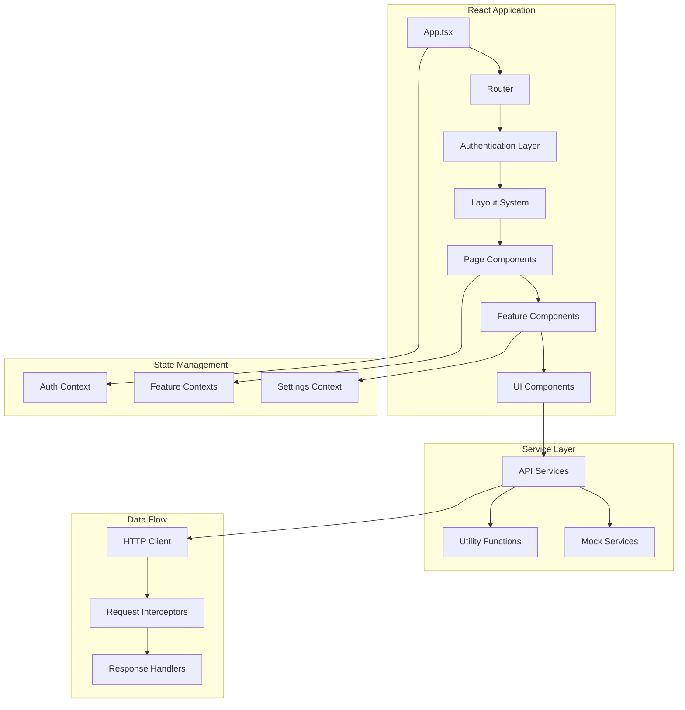
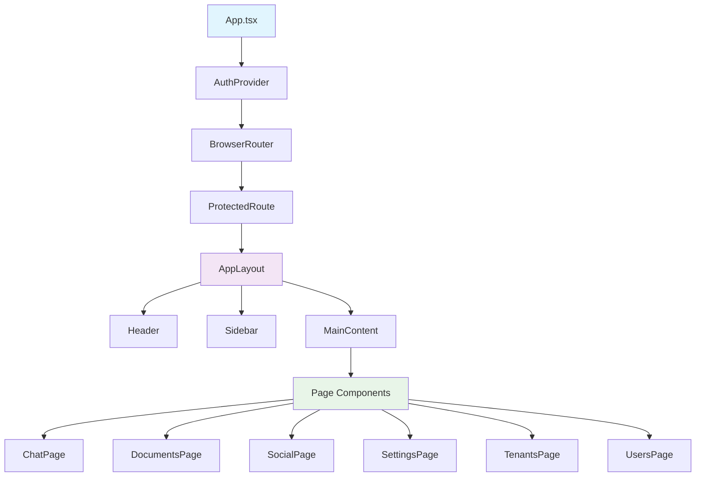
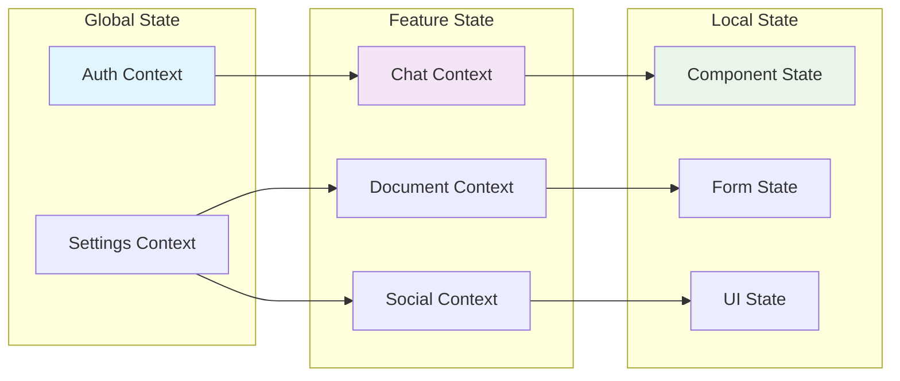
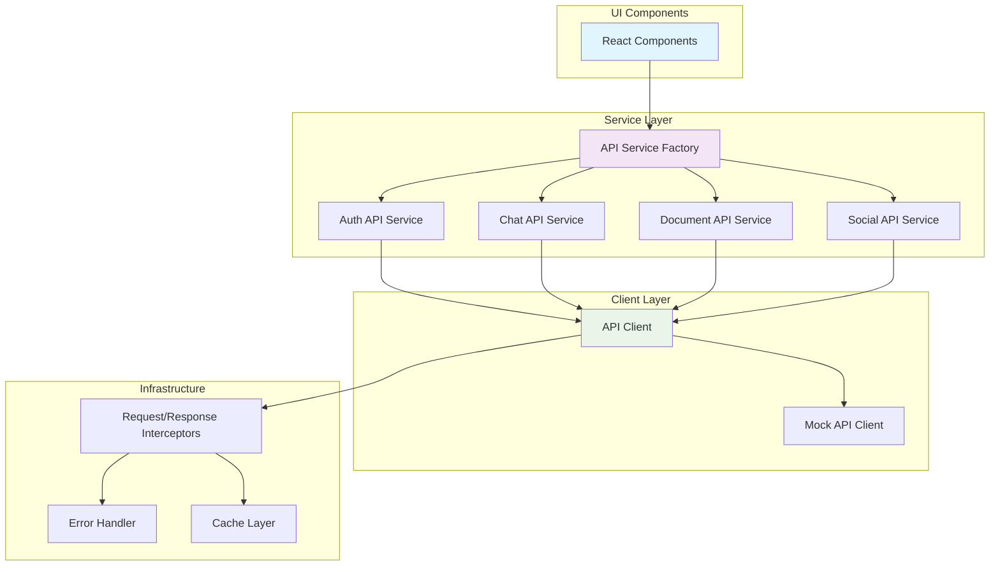
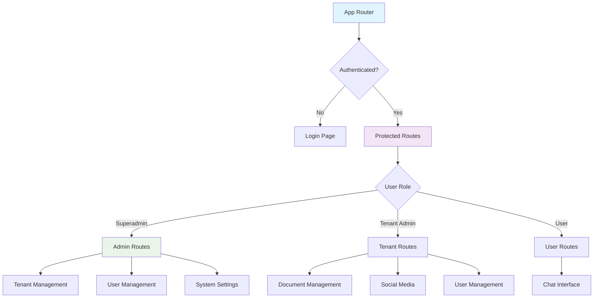
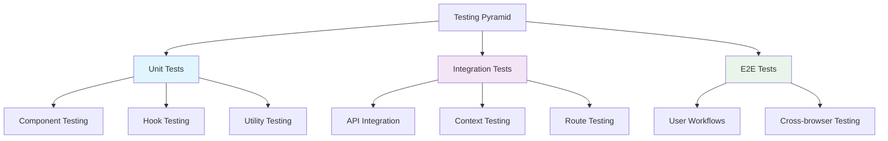
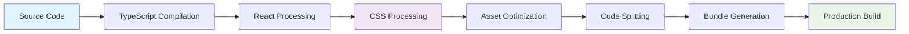

# Frontend Architecture

Comprehensive overview of the React frontend architecture, including component hierarchy, state management, and design patterns used in the MNFST-RAG Admin Dashboard.

## 🏗️ High-Level Architecture

The React frontend follows a clean, scalable architecture designed for maintainability and developer productivity.



## 🎨 Component Architecture

### Component Hierarchy



### Component Categories

#### 1. Layout Components
- **AppLayout** - Main application layout wrapper
- **Header** - Top navigation bar with user menu
- **Sidebar** - Side navigation with role-based menu
- **MainContent** - Main content area wrapper

#### 2. Page Components
- **ChatPage** - Chat interface and session management
- **DocumentsPage** - Document upload and management
- **SocialPage** - Social media link management
- **SettingsPage** - Application configuration
- **TenantsPage** - Tenant management (Superadmin)
- **UsersPage** - User management (Admin+)

#### 3. Feature Components
- **ChatWindow** - Chat interface with message display
- **DocumentUploader** - File upload with progress
- **SocialMediaForm** - Social media link form
- **UserManager** - User management interface

#### 4. UI Components
- **Button** - Reusable button with variants
- **Input** - Form input with validation
- **Modal** - Modal dialog component
- **Dropdown** - Dropdown menu component
- **LoadingSpinner** - Loading state indicator

## 🔄 State Management Architecture

### Global State Strategy



### Context Providers

#### Auth Context
```typescript
interface AuthState {
  user: User | null;
  tokens: Tokens | null;
  isAuthenticated: boolean;
  isLoading: boolean;
  login: (email: string, password: string) => Promise<void>;
  logout: () => void;
  refreshToken: () => Promise<void>;
}
```

#### Settings Context
```typescript
interface SettingsState {
  theme: 'light' | 'dark' | 'system';
  apiConfig: APIConfig;
  updateTheme: (theme: string) => void;
  updateAPIConfig: (config: Partial<APIConfig>) => void;
}
```

#### Chat Context
```typescript
interface ChatState {
  sessions: ChatSession[];
  currentSession: ChatSession | null;
  messages: Message[];
  isLoading: boolean;
  createSession: (title: string) => Promise<void>;
  sendMessage: (content: string) => Promise<void>;
  loadSessions: () => Promise<void>;
}
```

## 🛠️ Service Layer Architecture

### API Service Pattern



### Service Factory Pattern

```typescript
// API Service Factory
export const createAPIs = (): APIs => {
  if (mockConfig.enabled) {
    return {
      authAPI: mockAuthAPI,
      chatAPI: mockChatAPI,
      documentAPI: mockDocumentAPI,
      socialAPI: mockSocialAPI,
      tenantAPI: mockTenantAPI,
      userAPI: mockUserAPI
    };
  } else {
    return {
      authAPI: realAuthAPI,
      chatAPI: realChatAPI,
      documentAPI: realDocumentAPI,
      socialAPI: realSocialAPI,
      tenantAPI: realTenantAPI,
      userAPI: realUserAPI
    };
  }
};
```

### HTTP Client Configuration

```typescript
// API Client with interceptors
class APIClient {
  private client: AxiosInstance;

  constructor() {
    this.client = axios.create({
      baseURL: config.apiBaseUrl,
      timeout: 10000,
      headers: {
        'Content-Type': 'application/json',
      },
    });

    this.setupInterceptors();
  }

  private setupInterceptors() {
    // Request interceptor
    this.client.interceptors.request.use((config) => {
      const token = localStorage.getItem('accessToken');
      if (token) {
        config.headers.Authorization = `Bearer ${token}`;
      }
      return config;
    });

    // Response interceptor
    this.client.interceptors.response.use(
      (response) => response,
      async (error) => {
        if (error.response?.status === 401) {
          await this.handleTokenRefresh();
        }
        return Promise.reject(error);
      }
    );
  }
}
```

## 🎯 Routing Architecture

### Route Structure



### Route Configuration

Based on the actual App.tsx implementation, the routing structure is:

```typescript
// Actual route structure from App.tsx
<Routes>
  <Route path="/login" element={<LoginPage />} />
  <Route path="/" element={
    <ProtectedRoute>
      <AppLayout>
        <RoleBasedRoute
          roles={['superadmin']}
          element={<Navigate to="/tenants" replace />}
          fallback={<Navigate to="/chat" replace />}
        />
      </AppLayout>
    </ProtectedRoute>
  } />
  <Route path="/chat" element={
    <ProtectedRoute>
      <AppLayout>
        <RoleBasedRoute
          roles={['superadmin', 'tenant_admin', 'user']}
          element={<ChatPage />}
          fallback={<Navigate to="/chat" replace />}
        />
      </AppLayout>
    </ProtectedRoute>
  } />
  <Route path="/documents" element={
    <ProtectedRoute>
      <AppLayout>
        <RoleBasedRoute
          roles={['superadmin', 'tenant_admin']}
          element={<DocumentsPage />}
          fallback={<Navigate to="/chat" replace />}
        />
      </AppLayout>
    </ProtectedRoute>
  } />
  <Route path="/social" element={
    <ProtectedRoute>
      <AppLayout>
        <RoleBasedRoute
          roles={['superadmin', 'tenant_admin']}
          element={<SocialPage />}
          fallback={<Navigate to="/chat" replace />}
        />
      </AppLayout>
    </ProtectedRoute>
  } />
  <Route path="/settings" element={
    <ProtectedRoute>
      <AppLayout>
        <RoleBasedRoute
          roles={['superadmin', 'tenant_admin', 'user']}
          element={<SettingsPage />}
          fallback={<Navigate to="/chat" replace />}
        />
      </AppLayout>
    </ProtectedRoute>
  } />
  <Route path="/tenants" element={
    <ProtectedRoute>
      <AppLayout>
        <RoleBasedRoute
          roles={['superadmin']}
          element={<TenantsPage />}
          fallback={<Navigate to="/chat" replace />}
        />
      </AppLayout>
    </ProtectedRoute>
  } />
  <Route path="/users" element={
    <ProtectedRoute>
      <AppLayout>
        <RoleBasedRoute
          roles={['superadmin', 'tenant_admin']}
          element={<UsersPage />}
          fallback={<Navigate to="/chat" replace />}
        />
      </AppLayout>
    </ProtectedRoute>
  } />
  <Route path="/404" element={<NotFoundPage />} />
  <Route path="*" element={<Navigate to="/404" replace />} />
</Routes>
```

## 🎨 Design System Architecture

### Component Design Patterns

#### 1. Compound Components
```typescript
// Card compound component
const Card = ({ children, className, ...props }) => (
  <div className={`card ${className}`} {...props}>
    {children}
  </div>
);

Card.Header = ({ children, ...props }) => (
  <div className="card-header" {...props}>
    {children}
  </div>
);

Card.Body = ({ children, ...props }) => (
  <div className="card-body" {...props}>
    {children}
  </div>
);

// Usage
<Card>
  <Card.Header>Title</Card.Header>
  <Card.Body>Content</Card.Body>
</Card>
```

#### 2. Render Props Pattern
```typescript
// Data provider with render prop
const DataProvider = ({ url, children }) => {
  const [data, setData] = useState(null);
  const [loading, setLoading] = useState(false);

  useEffect(() => {
    fetchData(url).then(setData);
  }, [url]);

  return children({ data, loading, setData });
};

// Usage
<DataProvider url="/api/users">
  {({ data, loading }) => (
    loading ? <Spinner /> : <UserList users={data} />
  )}
</DataProvider>
```

#### 3. Custom Hooks Pattern
```typescript
// Custom hook for API data
const useAPI = (url, options = {}) => {
  const [data, setData] = useState(null);
  const [loading, setLoading] = useState(false);
  const [error, setError] = useState(null);

  const fetchData = useCallback(async () => {
    setLoading(true);
    setError(null);
    try {
      const result = await apiClient.get(url);
      setData(result.data);
    } catch (err) {
      setError(err);
    } finally {
      setLoading(false);
    }
  }, [url]);

  useEffect(() => {
    if (options.immediate !== false) {
      fetchData();
    }
  }, [fetchData, options.immediate]);

  return { data, loading, error, refetch: fetchData };
};
```

### Styling Architecture

#### Tailwind Configuration

Based on the actual tailwind.config.js in the project:

```javascript
// tailwind.config.js
/** @type {import('tailwindcss').Config} */
export default {
  content: [
    "./index.html",
    "./src/**/*.{js,ts,jsx,tsx}",
  ],
  theme: {
    extend: {
      colors: {
        primary: {
          50: '#eff6ff',
          500: '#3b82f6',
          600: '#2563eb',
          700: '#1d4ed8',
        },
        gray: {
          50: '#f9fafb',
          900: '#111827',
        },
      },
      fontFamily: {
        sans: ['Inter', 'ui-sans-serif', 'system-ui'],
      },
      spacing: {
        '18': '4.5rem',
        '88': '22rem',
      },
    },
  },
  plugins: [
    require('@tailwindcss/forms'),
    require('@tailwindcss/typography'),
  ],
  darkMode: 'class',
}
```

#### Component Styling Strategy
```typescript
// Consistent styling approach
const Button = ({ variant = 'primary', size = 'md', children, ...props }) => {
  const baseClasses = 'font-medium rounded-md focus:outline-none focus:ring-2';
  
  const variantClasses = {
    primary: 'bg-primary-600 text-white hover:bg-primary-700',
    secondary: 'bg-gray-200 text-gray-900 hover:bg-gray-300',
    danger: 'bg-red-600 text-white hover:bg-red-700',
  };
  
  const sizeClasses = {
    sm: 'px-3 py-1.5 text-sm',
    md: 'px-4 py-2 text-base',
    lg: 'px-6 py-3 text-lg',
  };

  return (
    <button
      className={`${baseClasses} ${variantClasses[variant]} ${sizeClasses[size]}`}
      {...props}
    >
      {children}
    </button>
  );
};
```

## 🔧 Performance Architecture

### Code Splitting Strategy

```typescript
// Lazy loading for better performance
const ChatPage = lazy(() => import('../pages/ChatPage'));
const DocumentsPage = lazy(() => import('../pages/DocumentsPage'));
const SocialPage = lazy(() => import('../pages/SocialPage'));

// Route-based code splitting
const routes = [
  {
    path: '/chat',
    element: (
      <Suspense fallback={<PageLoader />}>
        <ChatPage />
      </Suspense>
    ),
  },
];
```

### Memoization Strategy

```typescript
// Component memoization
const Message = React.memo(({ message, onEdit }) => {
  return (
    <div className="message">
      <p>{message.content}</p>
      <Button onClick={() => onEdit(message.id)}>Edit</Button>
    </div>
  );
}, (prevProps, nextProps) => {
  return prevProps.message.id === nextProps.message.id;
});

// Hook memoization
const useChatMessages = (sessionId) => {
  const messages = useMemo(() => {
    return getMessagesForSession(sessionId);
  }, [sessionId]);

  return messages;
};
```

## 🧪 Testing Architecture

### Testing Strategy



### Component Testing Example

```typescript
// Button component test
import { render, screen, fireEvent } from '@testing-library/react';
import { Button } from './Button';

describe('Button', () => {
  it('renders with correct text', () => {
    render(<Button>Click me</Button>);
    expect(screen.getByRole('button')).toBeInTheDocument();
    expect(screen.getByText('Click me')).toBeInTheDocument();
  });

  it('calls onClick when clicked', () => {
    const handleClick = jest.fn();
    render(<Button onClick={handleClick}>Click me</Button>);
    
    fireEvent.click(screen.getByRole('button'));
    expect(handleClick).toHaveBeenCalledTimes(1);
  });

  it('applies correct variant classes', () => {
    render(<Button variant="secondary">Secondary</Button>);
    const button = screen.getByRole('button');
    expect(button).toHaveClass('bg-gray-200', 'text-gray-900');
  });
});
```

## 🔒 Security Architecture

### Frontend Security Measures

#### 1. Token Management
```typescript
// Secure token storage
const tokenManager = {
  setTokens: (tokens: Tokens) => {
    // Use httpOnly cookies in production
    if (import.meta.env.PROD) {
      // Set httpOnly cookies via backend
    } else {
      // Use localStorage for development
      localStorage.setItem('accessToken', tokens.accessToken);
      localStorage.setItem('refreshToken', tokens.refreshToken);
    }
  },
  
  getTokens: (): Tokens | null => {
    if (import.meta.env.PROD) {
      // Get from httpOnly cookies
      return null; // Backend will handle
    } else {
      return {
        accessToken: localStorage.getItem('accessToken'),
        refreshToken: localStorage.getItem('refreshToken'),
      };
    }
  },
};
```

#### 2. XSS Prevention
```typescript
// Safe content rendering
const SafeContent = ({ content }) => {
  const sanitizedContent = DOMPurify.sanitize(content);
  return <div dangerouslySetInnerHTML={{ __html: sanitizedContent }} />;
};

// Alternative: Use text content when possible
const MessageContent = ({ content }) => {
  return <p className="message-text">{content}</p>;
};
```

#### 3. CSRF Protection
```typescript
// CSRF token handling
const apiClient = axios.create({
  baseURL: config.apiBaseUrl,
  withCredentials: true, // Send cookies
  headers: {
    'X-Requested-With': 'XMLHttpRequest', // CSRF indicator
  },
});
```

## 🚀 Build Architecture

### Build Process



### Vite Configuration

Based on the actual vite.config.ts in the project:

```typescript
// vite.config.ts
import { defineConfig } from 'vite'
import react from '@vitejs/plugin-react'

// https://vitejs.dev/config/
export default defineConfig({
  plugins: [react()],
  resolve: {
    alias: {
      '@': resolve(__dirname, './src'),
      '@components': resolve(__dirname, './src/components'),
      '@pages': resolve(__dirname, './src/pages'),
      '@services': resolve(__dirname, './src/services'),
      '@types': resolve(__dirname, './src/types'),
    },
  },
  build: {
    outDir: 'dist',
    sourcemap: true,
    rollupOptions: {
      output: {
        manualChunks: {
          vendor: ['react', 'react-dom'],
          router: ['react-router-dom'],
          ui: ['@headlessui/react', '@heroicons/react'],
        },
      },
    },
  },
  server: {
    port: 3000,
    proxy: {
      '/api': {
        target: 'http://localhost:8080',
        changeOrigin: true,
      },
    },
  },
});
```

## 📊 Monitoring & Analytics

### Performance Monitoring

```typescript
// Performance tracking
const usePerformanceTracking = () => {
  useEffect(() => {
    // Track page load time
    const navigation = performance.getEntriesByType('navigation')[0];
    const loadTime = navigation.loadEventEnd - navigation.loadEventStart;
    
    // Send to analytics
    analytics.track('page_load_time', {
      value: loadTime,
      page: window.location.pathname,
    });

    // Track component render time
    const observer = new PerformanceObserver((list) => {
      list.getEntries().forEach((entry) => {
        if (entry.entryType === 'measure') {
          analytics.track('component_render_time', {
            component: entry.name,
            duration: entry.duration,
          });
        }
      });
    });

    observer.observe({ entryTypes: ['measure'] });

    return () => observer.disconnect();
  }, []);
};
```

### Error Tracking

```typescript
// Error boundary with tracking
class ErrorBoundary extends React.Component {
  componentDidCatch(error, errorInfo) {
    // Log to error tracking service
    errorTracker.captureException(error, {
      extra: errorInfo,
      tags: {
        component: 'ErrorBoundary',
      },
    });

    // Log to console in development
    if (import.meta.env.DEV) {
      console.error('Error caught by boundary:', error, errorInfo);
    }
  }

  render() {
    if (this.state.hasError) {
      return <ErrorFallback />;
    }

    return this.props.children;
  }
}
```

---

## 🎯 Key Architectural Decisions

### 1. React Context for State Management
**Decision**: Use React Context instead of Redux/Zustand
**Rationale**:
- Built into React, no additional dependencies
- Simple and predictable data flow
- Good for medium-sized applications
- Easy to test and debug

### 2. Component Composition over Inheritance
**Decision**: Favor composition patterns and compound components
**Rationale**:
- More flexible and reusable
- Easier to test and maintain
- Better TypeScript support
- Follows React best practices

### 3. Custom Hooks for Logic Reuse
**Decision**: Extract reusable logic into custom hooks
**Rationale**:
- Clean separation of concerns
- Easy to test and reuse
- Better component readability
- Follows React patterns

### 4. Mock API System
**Decision**: Comprehensive mock API for development
**Rationale**:
- Enables frontend development without backend
- Consistent test data across scenarios
- Easy testing of edge cases
- Fast development iteration

### 5. TypeScript Throughout
**Decision**: Use TypeScript for all frontend code
**Rationale**:
- Type safety and better developer experience
- Self-documenting code
- Better IDE support and refactoring
- Reduced runtime errors

---

**Related Documentation**:
- [System Architecture](./system-architecture.md) - Overall system design
- [Component Architecture](./component-architecture.md) - Detailed component patterns
- [API Integration](../implementation/api-integration.md) - API usage and integration
- [State Management](../implementation/state-management.md) - State management patterns