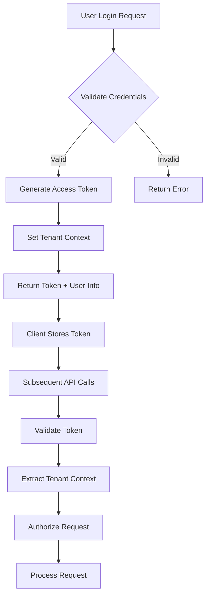
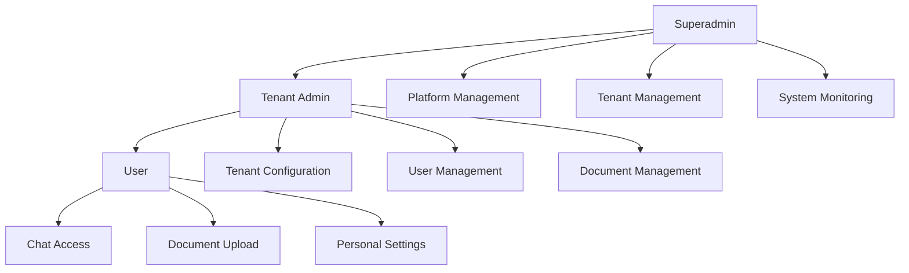

# Authentication & Authorization System

Complete guide to the authentication and authorization system for the RAG Chat multi-tenant SaaS platform, including user roles, permissions, and security measures.

## 🎯 Overview

The authentication and authorization system ensures secure access to the RAG Chat platform while maintaining strict data isolation between tenants. The system implements role-based access control (RBAC) with multi-level security measures.

## 🔐 Authentication Architecture

### Authentication Flow



### Token Structure

#### JWT Access Token

```typescript
interface JWTPayload {
  // Standard JWT claims
  iss: string;              // Issuer (api.ragchat.com)
  sub: string;              // User ID
  aud: string;              // Audience (api.ragchat.com)
  exp: number;              // Expiration time
  iat: number;              // Issued at time
  jti: string;              // JWT ID (unique identifier)
  
  // Custom claims
  type: 'sa' | 'ta' | 'u'; // Token type: superadmin, tenant_admin, user
  tenantId?: string;        // Tenant ID (for tenant tokens)
  role: string;             // User role
  permissions: string[];    // User permissions
  sessionId: string;        // Session identifier
  tokenVersion: number;     // Token version for revocation
}
```

#### Refresh Token

```typescript
interface RefreshToken {
  id: string;
  userId: string;
  tenantId?: string;
  tokenHash: string;        // Hashed token
  expiresAt: Date;
  createdAt: Date;
  lastUsedAt: Date;
  deviceInfo: {
    userAgent: string;
    ip: string;
    platform: string;
  };
  revoked: boolean;
}
```

### Authentication Methods

#### Email/Password Authentication

```typescript
interface EmailPasswordAuth {
  email: string;
  password: string;
  twoFactorCode?: string;   // Required if 2FA enabled
  rememberMe?: boolean;     // Extend session duration
}
```

#### Single Sign-On (SSO)

```typescript
interface SSOConfig {
  provider: 'saml' | 'oidc' | 'azure-ad' | 'google-workspace';
  config: {
    entityId?: string;      // SAML entity ID
    ssoUrl?: string;        // SAML SSO URL
    certificate?: string;   // SAML certificate
    clientId?: string;      // OIDC client ID
    clientSecret?: string;  // OIDC client secret
    issuer?: string;        // OIDC issuer
    scopes?: string[];      // OIDC scopes
  };
  mapping: {
    emailAttribute: string; // Attribute containing email
    nameAttribute: string;  // Attribute containing name
    roleAttribute?: string; // Attribute containing role
  };
}
```

#### API Key Authentication

```typescript
interface APIKey {
  id: string;
  tenantId: string;
  name: string;
  keyHash: string;
  permissions: string[];
  expiresAt?: Date;
  lastUsedAt?: Date;
  createdAt: Date;
  createdBy: string;
  rateLimit: {
    requests: number;
    window: number;         // Window in seconds
  };
}
```

## 👥 User Roles & Permissions

### Role Hierarchy



### Superadmin Role

#### Permissions

```typescript
const SUPERADMIN_PERMISSIONS = {
  // Tenant Management
  'tenant:create': 'Create new tenants',
  'tenant:read': 'View tenant information',
  'tenant:update': 'Update tenant settings',
  'tenant:delete': 'Delete tenants',
  'tenant:suspend': 'Suspend tenants',
  
  // User Management
  'user:create': 'Create users across tenants',
  'user:read': 'View user information',
  'user:update': 'Update user accounts',
  'user:delete': 'Delete user accounts',
  'user:suspend': 'Suspend user accounts',
  
  // Platform Management
  'platform:configure': 'Configure platform settings',
  'platform:monitor': 'View platform analytics',
  'platform:maintenance': 'Perform maintenance tasks',
  
  // System Administration
  'system:logs': 'Access system logs',
  'system:backup': 'Manage system backups',
  'system:security': 'Manage security settings',
  
  // Billing Management
  'billing:read': 'View billing information',
  'billing:update': 'Update billing settings',
  'billing:export': 'Export billing reports'
} as const;
```

#### Capabilities

- Create and manage all tenants
- Access any tenant data (with audit trail)
- Manage platform-wide settings
- View system analytics and logs
- Perform maintenance operations
- Manage billing and subscriptions

### Tenant Admin Role

#### Permissions

```typescript
const TENANT_ADMIN_PERMISSIONS = {
  // Tenant Configuration
  'tenant:configure': 'Configure tenant settings',
  'tenant:branding': 'Manage tenant branding',
  'tenant:integrations': 'Manage third-party integrations',
  
  // User Management (tenant-scoped)
  'tenant:user:create': 'Create tenant users',
  'tenant:user:read': 'View tenant user information',
  'tenant:user:update': 'Update tenant user accounts',
  'tenant:user:delete': 'Delete tenant user accounts',
  'tenant:user:suspend': 'Suspend tenant user accounts',
  
  // Document Management
  'tenant:document:create': 'Upload documents',
  'tenant:document:read': 'View documents',
  'tenant:document:update': 'Update document metadata',
  'tenant:document:delete': 'Delete documents',
  'tenant:document:manage': 'Manage all documents',
  
  // Analytics & Reporting
  'tenant:analytics:read': 'View tenant analytics',
  'tenant:analytics:export': 'Export analytics data',
  
  // Security Settings
  'tenant:security:configure': 'Configure security settings',
  'tenant:security:audit': 'View audit logs'
} as const;
```

#### Capabilities

- Manage tenant users and roles
- Configure tenant settings and branding
- Manage documents and access controls
- View tenant analytics and reports
- Configure security policies
- Manage integrations and API access

### User Role

#### Permissions

```typescript
const USER_PERMISSIONS = {
  // Personal Access
  'profile:read': 'View own profile',
  'profile:update': 'Update own profile',
  
  // Document Access
  'document:read': 'View accessible documents',
  'document:create': 'Upload documents',
  'document:update': 'Update own documents',
  'document:delete': 'Delete own documents',
  
  // Chat Access
  'chat:create': 'Create chat sessions',
  'chat:read': 'View chat history',
  'chat:write': 'Send chat messages',
  
  // Search Access
  'search:execute': 'Search documents',
  'search:export': 'Export search results'
} as const;
```

#### Capabilities

- Access assigned documents
- Upload and manage own documents
- Create and participate in chat sessions
- Search across accessible content
- Manage personal profile and settings

## 🔒 Security Measures

### Password Security

#### Password Policy

```typescript
interface PasswordPolicy {
  minLength: number;           // Minimum password length
  maxLength: number;           // Maximum password length
  requireUppercase: boolean;   // Require uppercase letters
  requireLowercase: boolean;   // Require lowercase letters
  requireNumbers: boolean;     // Require numbers
  requireSpecialChars: boolean; // Require special characters
  preventCommonPasswords: boolean; // Block common passwords
  preventUserInfo: boolean;    // Prevent using user info in password
  expiryDays: number;          // Password expiry in days
  historyCount: number;        // Number of previous passwords to remember
  complexityScore: number;     // Minimum complexity score (0-100)
}
```

#### Password Validation

```typescript
class PasswordValidator {
  validate(password: string, user: User, policy: PasswordPolicy): ValidationResult {
    const errors: string[] = [];
    
    // Length validation
    if (password.length < policy.minLength) {
      errors.push(`Password must be at least ${policy.minLength} characters`);
    }
    
    if (password.length > policy.maxLength) {
      errors.push(`Password must not exceed ${policy.maxLength} characters`);
    }
    
    // Character requirements
    if (policy.requireUppercase && !/[A-Z]/.test(password)) {
      errors.push('Password must contain uppercase letters');
    }
    
    if (policy.requireLowercase && !/[a-z]/.test(password)) {
      errors.push('Password must contain lowercase letters');
    }
    
    if (policy.requireNumbers && !/\d/.test(password)) {
      errors.push('Password must contain numbers');
    }
    
    if (policy.requireSpecialChars && !/[!@#$%^&*(),.?":{}|<>]/.test(password)) {
      errors.push('Password must contain special characters');
    }
    
    // User info validation
    if (policy.preventUserInfo) {
      const userInfo = [user.email, user.firstName, user.lastName].join(' ').toLowerCase();
      if (userInfo.includes(password.toLowerCase())) {
        errors.push('Password cannot contain your personal information');
      }
    }
    
    // Common password validation
    if (policy.preventCommonPasswords && this.isCommonPassword(password)) {
      errors.push('Password is too common. Please choose a more secure password');
    }
    
    // Complexity scoring
    const complexity = this.calculateComplexity(password);
    if (complexity < policy.complexityScore) {
      errors.push(`Password complexity score must be at least ${policy.complexityScore}`);
    }
    
    return {
      isValid: errors.length === 0,
      errors,
      complexity
    };
  }
  
  private calculateComplexity(password: string): number {
    let score = 0;
    
    // Length contribution
    score += Math.min(password.length * 2, 40);
    
    // Character variety
    if (/[a-z]/.test(password)) score += 10;
    if (/[A-Z]/.test(password)) score += 10;
    if (/\d/.test(password)) score += 10;
    if (/[!@#$%^&*(),.?":{}|<>]/.test(password)) score += 15;
    
    // Pattern diversity
    const uniqueChars = new Set(password).size;
    score += Math.min(uniqueChars * 2, 15);
    
    return Math.min(score, 100);
  }
}
```

### Two-Factor Authentication (2FA)

#### 2FA Methods

```typescript
interface TwoFactorMethod {
  type: 'totp' | 'sms' | 'email' | 'hardware-key';
  enabled: boolean;
  setup: boolean;
  lastUsed?: Date;
}

interface TOTPSetup {
  secret: string;
  qrCode: string;
  backupCodes: string[];
}

interface SMS2FA {
  phoneNumber: string;
  verified: boolean;
  carrier: string;
}

interface Email2FA {
  email: string;
  verified: boolean;
}

interface HardwareKey2FA {
  credentialId: string;
  publicKey: string;
  name: string;
}
```

#### 2FA Implementation

```typescript
class TwoFactorAuthService {
  // Generate TOTP secret
  generateTOTPSecret(userId: string): TOTPSetup {
    const secret = speakeasy.generateSecret({
      name: `RAG Chat (${userId})`,
      issuer: 'RAG Chat',
      length: 32
    });
    
    const qrCode = qrcode.toDataURL(secret.otpauth_url!);
    const backupCodes = this.generateBackupCodes();
    
    return {
      secret: secret.base32!,
      qrCode,
      backupCodes
    };
  }
  
  // Verify TOTP token
  verifyTOTPToken(userId: string, token: string): boolean {
    const userSecret = this.getUserTOTPSecret(userId);
    return speakeasy.totp.verify({
      secret: userSecret,
      encoding: 'base32',
      token,
      window: 2, // Allow 2 steps before/after
      time: Math.floor(Date.now() / 1000)
    });
  }
  
  // Send SMS code
  async sendSMSCode(userId: string, phoneNumber: string): Promise<void> {
    const code = this.generateNumericCode(6);
    const expiresAt = new Date(Date.now() + 5 * 60 * 1000); // 5 minutes
    
    await this.store2FACode(userId, code, expiresAt, 'sms');
    
    await this.smsService.send({
      to: phoneNumber,
      message: `Your RAG Chat verification code is: ${code}`
    });
  }
  
  // Verify SMS/Email code
  async verifyCode(userId: string, code: string, type: 'sms' | 'email'): Promise<boolean> {
    const storedCode = await this.getStored2FACode(userId, type);
    
    if (!storedCode || storedCode.expiresAt < new Date()) {
      return false;
    }
    
    const isValid = storedCode.code === code;
    
    if (isValid) {
      await this.consume2FACode(storedCode.id);
    }
    
    return isValid;
  }
  
  private generateBackupCodes(): string[] {
    const codes: string[] = [];
    for (let i = 0; i < 10; i++) {
      codes.push(this.generateNumericCode(8));
    }
    return codes;
  }
  
  private generateNumericCode(length: number): string {
    return Array.from({ length }, () => Math.floor(Math.random() * 10)).join('');
  }
}
```

### Session Management

#### Session Configuration

```typescript
interface SessionConfig {
  accessToken: {
    expiresIn: number;        // Access token lifetime (seconds)
    refreshThreshold: number; // Refresh threshold (seconds)
  };
  refreshToken: {
    expiresIn: number;        // Refresh token lifetime (seconds)
    maxActive: number;        // Maximum active refresh tokens
  };
  session: {
    timeout: number;          // Session timeout (seconds)
    maxConcurrent: number;    // Maximum concurrent sessions
  };
  security: {
    requireReauth: boolean;   // Require re-authentication for sensitive operations
    detectAnomalies: boolean;  // Detect anomalous login patterns
    ipWhitelist: string[];    // Allowed IP addresses
  };
}
```

#### Session Monitoring

```typescript
class SessionMonitor {
  async detectAnomalousLogin(userId: string, loginAttempt: LoginAttempt): Promise<AnomalyResult> {
    const userHistory = await this.getUserLoginHistory(userId, 30); // Last 30 days
    
    const anomalies: string[] = [];
    
    // IP address anomaly
    const knownIPs = new Set(userHistory.map(h => h.ip));
    if (!knownIPs.has(loginAttempt.ip)) {
      anomalies.push('New IP address');
    }
    
    // Geographic anomaly
    const knownCountries = new Set(userHistory.map(h => h.country));
    if (!knownCountries.has(loginAttempt.country)) {
      anomalies.push('New geographic location');
    }
    
    // Device anomaly
    const knownDevices = new Set(userHistory.map(h => h.deviceFingerprint));
    if (!knownDevices.has(loginAttempt.deviceFingerprint)) {
      anomalies.push('New device');
    }
    
    // Time anomaly
    const usualHours = userHistory.map(h => new Date(h.timestamp).getHours());
    const currentHour = new Date(loginAttempt.timestamp).getHours();
    if (!usualHours.includes(currentHour)) {
      anomalies.push('Unusual login time');
    }
    
    // Velocity anomaly (multiple failed attempts)
    const recentFailures = await this.getRecentFailedAttempts(userId, 60); // Last hour
    if (recentFailures.length > 5) {
      anomalies.push('High failure rate');
    }
    
    return {
      isAnomalous: anomalies.length > 0,
      anomalies,
      riskScore: this.calculateRiskScore(anomalies),
      requireAdditionalVerification: anomalies.length >= 2
    };
  }
  
  private calculateRiskScore(anomalies: string[]): number {
    const riskWeights = {
      'New IP address': 20,
      'New geographic location': 30,
      'New device': 25,
      'Unusual login time': 15,
      'High failure rate': 40
    };
    
    return anomalies.reduce((score, anomaly) => {
      return score + (riskWeights[anomaly] || 10);
    }, 0);
  }
}
```

## 🛡️ Data Isolation & Security

### Row-Level Security

#### Database Policies

```sql
-- Enable RLS on all tenant-scoped tables
ALTER TABLE users ENABLE ROW LEVEL SECURITY;
ALTER TABLE documents ENABLE ROW LEVEL SECURITY;
ALTER TABLE chat_sessions ENABLE ROW LEVEL SECURITY;
ALTER TABLE chat_messages ENABLE ROW LEVEL SECURITY;

-- User access policy
CREATE POLICY user_isolation ON users
    FOR ALL TO authenticated
    USING (
        tenant_id = current_setting('app.current_tenant_id')::uuid
        OR
        (current_setting('app.user_role') = 'superadmin')
    );

-- Document access policy
CREATE POLICY document_isolation ON documents
    FOR ALL TO authenticated
    USING (
        tenant_id = current_setting('app.current_tenant_id')::uuid
        AND
        (
            created_by = current_setting('app.current_user_id')::uuid
            OR
            current_setting('app.user_role') IN ('tenant_admin', 'superadmin')
        )
    );

-- Chat session access policy
CREATE POLICY chat_isolation ON chat_sessions
    FOR ALL TO authenticated
    USING (
        tenant_id = current_setting('app.current_tenant_id')::uuid
        AND
        (
            user_id = current_setting('app.current_user_id')::uuid
            OR
            current_setting('app.user_role') IN ('tenant_admin', 'superadmin')
        )
    );
```

### Data Encryption

#### Encryption at Rest

```typescript
interface EncryptionConfig {
  algorithm: 'AES-256-GCM';
  keyRotation: {
    enabled: boolean;
    interval: 'monthly' | 'quarterly' | 'yearly';
    retentionPeriod: number; // Keep old keys for N days
  };
  fields: {
    encrypted: string[];      // Fields to encrypt
    hashed: string[];         // Fields to hash
    masked: string[];         // Fields to mask
  };
}

class DataEncryptionService {
  private masterKey: string;
  private keyVersion: number;
  
  async encrypt(data: any, context: EncryptionContext): Promise<EncryptedData> {
    const key = await this.getEncryptionKey(context.tenantId);
    const iv = crypto.randomBytes(16);
    
    const cipher = crypto.createCipher('aes-256-gcm', key);
    cipher.setAAD(Buffer.from(context.additionalData || ''));
    
    let encrypted = cipher.update(JSON.stringify(data), 'utf8', 'hex');
    encrypted += cipher.final('hex');
    
    const authTag = cipher.getAuthTag();
    
    return {
      data: encrypted,
      iv: iv.toString('hex'),
      authTag: authTag.toString('hex'),
      keyVersion: this.keyVersion,
      algorithm: 'AES-256-GCM'
    };
  }
  
  async decrypt(encryptedData: EncryptedData, context: EncryptionContext): Promise<any> {
    const key = await this.getEncryptionKey(context.tenantId, encryptedData.keyVersion);
    
    const decipher = crypto.createDecipher('aes-256-gcm', key);
    decipher.setAAD(Buffer.from(context.additionalData || ''));
    decipher.setAuthTag(Buffer.from(encryptedData.authTag, 'hex'));
    
    let decrypted = decipher.update(encryptedData.data, 'hex', 'utf8');
    decrypted += decipher.final('utf8');
    
    return JSON.parse(decrypted);
  }
  
  private async getEncryptionKey(tenantId: string, version?: number): Promise<Buffer> {
    // Implementation for key retrieval with versioning
    // This would integrate with a key management service
  }
}
```

### Audit Logging

#### Audit Event Structure

```typescript
interface AuditEvent {
  id: string;
  timestamp: Date;
  userId: string;
  tenantId?: string;
  action: string;
  resource: string;
  resourceId?: string;
  outcome: 'success' | 'failure' | 'partial';
  details: {
    ip: string;
    userAgent: string;
    requestId: string;
    changes?: Record<string, any>;
    previousValues?: Record<string, any>;
    newValues?: Record<string, any>;
  };
  risk: 'low' | 'medium' | 'high' | 'critical';
  category: 'authentication' | 'authorization' | 'data_access' | 'configuration' | 'system';
}

class AuditService {
  async logEvent(event: Omit<AuditEvent, 'id' | 'timestamp'>): Promise<void> {
    const auditEvent: AuditEvent = {
      ...event,
      id: generateUUID(),
      timestamp: new Date()
    };
    
    // Store in database
    await this.auditRepository.create(auditEvent);
    
    // Send to SIEM system for critical events
    if (event.risk === 'critical') {
      await this.sendToSIEM(auditEvent);
    }
    
    // Check for security alerts
    await this.checkForSecurityAlerts(auditEvent);
  }
  
  async checkForSecurityAlerts(event: AuditEvent): Promise<void> {
    // Multiple failed logins
    if (event.action === 'login_failed') {
      const recentFailures = await this.getRecentEvents({
        userId: event.userId,
        action: 'login_failed',
        timeWindow: '1h'
      });
      
      if (recentFailures.length >= 5) {
        await this.triggerSecurityAlert({
          type: 'brute_force_attack',
          userId: event.userId,
          details: { attempts: recentFailures.length }
        });
      }
    }
    
    // Unauthorized access attempts
    if (event.action === 'access_denied' && event.risk === 'high') {
      await this.triggerSecurityAlert({
        type: 'unauthorized_access',
        userId: event.userId,
        tenantId: event.tenantId,
        details: { resource: event.resource }
      });
    }
  }
}
```

## 🔐 API Security

### Rate Limiting

```typescript
interface RateLimitConfig {
  windowMs: number;          // Time window in milliseconds
  maxRequests: number;        // Maximum requests per window
  skipSuccessfulRequests: boolean;
  skipFailedRequests: boolean;
  keyGenerator: (req: Request) => string;
  handler: (req: Request, res: Response) => void;
}

class RateLimitService {
  private limits: Map<string, RateLimitConfig> = new Map();
  
  constructor() {
    // Configure different limits for different endpoints
    this.limits.set('auth', {
      windowMs: 15 * 60 * 1000, // 15 minutes
      maxRequests: 5,
      skipSuccessfulRequests: false,
      skipFailedRequests: false,
      keyGenerator: (req) => `auth:${req.ip}`,
      handler: this.rateLimitHandler
    });
    
    this.limits.set('api', {
      windowMs: 60 * 1000, // 1 minute
      maxRequests: 100,
      skipSuccessfulRequests: true,
      skipFailedRequests: false,
      keyGenerator: (req) => `api:${req.user?.tenantId}:${req.user?.id}`,
      handler: this.rateLimitHandler
    });
    
    this.limits.set('upload', {
      windowMs: 60 * 1000, // 1 minute
      maxRequests: 10,
      skipSuccessfulRequests: false,
      skipFailedRequests: false,
      keyGenerator: (req) => `upload:${req.user?.tenantId}`,
      handler: this.rateLimitHandler
    });
  }
  
  middleware(type: string) {
    const config = this.limits.get(type);
    if (!config) {
      throw new Error(`Rate limit configuration not found for type: ${type}`);
    }
    
    return rateLimit(config);
  }
  
  private rateLimitHandler = (req: Request, res: Response): void => {
    res.status(429).json({
      success: false,
      error: {
        code: 'RATE_LIMIT_EXCEEDED',
        message: 'Too many requests, please try again later.',
        details: {
          retryAfter: Math.ceil(this.limits.get('api')!.windowMs / 1000)
        }
      }
    });
  };
}
```

### Input Validation & Sanitization

```typescript
class ValidationService {
  validateInput(schema: Joi.Schema, source: 'body' | 'query' | 'params') {
    return (req: Request, res: Response, next: NextFunction) => {
      const data = req[source];
      const { error, value } = schema.validate(data, {
        abortEarly: false,
        stripUnknown: true,
        convert: true
      });
      
      if (error) {
        return res.status(400).json({
          success: false,
          error: {
            code: 'VALIDATION_ERROR',
            message: 'Invalid input data',
            details: error.details.map(detail => ({
              field: detail.path.join('.'),
              message: detail.message,
              value: detail.context?.value
            }))
          }
        });
      }
      
      // Sanitize input
      req[source] = this.sanitizeInput(value);
      next();
    };
  }
  
  private sanitizeInput(data: any): any {
    if (typeof data === 'string') {
      return DOMPurify.sanitize(data.trim());
    }
    
    if (Array.isArray(data)) {
      return data.map(item => this.sanitizeInput(item));
    }
    
    if (typeof data === 'object' && data !== null) {
      const sanitized: any = {};
      for (const [key, value] of Object.entries(data)) {
        sanitized[key] = this.sanitizeInput(value);
      }
      return sanitized;
    }
    
    return data;
  }
}
```

## 🚀 Implementation Examples

### Authentication Middleware

```typescript
interface AuthenticatedRequest extends Request {
  user: {
    id: string;
    tenantId?: string;
    role: string;
    permissions: string[];
  };
  tenant?: {
    id: string;
    settings: TenantSettings;
  };
}

class AuthenticationMiddleware {
  async authenticate(req: AuthenticatedRequest, res: Response, next: NextFunction): Promise<void> {
    try {
      const token = this.extractToken(req);
      if (!token) {
        return res.status(401).json({
          success: false,
          error: {
            code: 'AUTH_001',
            message: 'Authentication required'
          }
        });
      }
      
      const payload = await this.verifyToken(token);
      if (!payload) {
        return res.status(401).json({
          success: false,
          error: {
            code: 'AUTH_002',
            message: 'Invalid or expired token'
          }
        });
      }
      
      // Check if token is revoked
      if (await this.isTokenRevoked(payload.jti)) {
        return res.status(401).json({
          success: false,
          error: {
            code: 'AUTH_003',
            message: 'Token has been revoked'
          }
        });
      }
      
      // Load user information
      const user = await this.userService.findById(payload.sub);
      if (!user || user.status !== 'active') {
        return res.status(401).json({
          success: false,
          error: {
            code: 'AUTH_004',
            message: 'User account not found or inactive'
          }
        });
      }
      
      // Set tenant context for tenant users
      if (payload.tenantId) {
        const tenant = await this.tenantService.findById(payload.tenantId);
        if (!tenant || tenant.status !== 'active') {
          return res.status(403).json({
            success: false,
            error: {
              code: 'TENANT_001',
              message: 'Tenant not found or inactive'
            }
          });
        }
        
        req.tenant = {
          id: tenant.id,
          settings: tenant.settings
        };
        
        // Set tenant context for database operations
        await this.setTenantContext(tenant.id, user.id, user.role);
      }
      
      req.user = {
        id: user.id,
        tenantId: payload.tenantId,
        role: user.role,
        permissions: payload.permissions
      };
      
      // Update last activity
      await this.updateLastActivity(user.id);
      
      next();
    } catch (error) {
      console.error('Authentication error:', error);
      res.status(500).json({
        success: false,
        error: {
          code: 'SYS_001',
          message: 'Internal server error'
        }
      });
    }
  }
  
  private extractToken(req: Request): string | null {
    const authHeader = req.headers.authorization;
    if (authHeader && authHeader.startsWith('Bearer ')) {
      return authHeader.substring(7);
    }
    return null;
  }
  
  private async verifyToken(token: string): Promise<JWTPayload | null> {
    try {
      const payload = jwt.verify(token, process.env.JWT_SECRET!) as JWTPayload;
      return payload;
    } catch (error) {
      if (error instanceof jwt.TokenExpiredError) {
        return null;
      }
      if (error instanceof jwt.JsonWebTokenError) {
        return null;
      }
      throw error;
    }
  }
  
  private async setTenantContext(tenantId: string, userId: string, userRole: string): Promise<void> {
    // Set PostgreSQL session variables for RLS
    await this.database.query(`
      SET app.current_tenant_id = '${tenantId}';
      SET app.current_user_id = '${userId}';
      SET app.user_role = '${userRole}';
    `);
  }
}
```

### Authorization Middleware

```typescript
class AuthorizationMiddleware {
  requirePermission(permission: string) {
    return (req: AuthenticatedRequest, res: Response, next: NextFunction): void => {
      if (!req.user) {
        return res.status(401).json({
          success: false,
          error: {
            code: 'AUTH_001',
            message: 'Authentication required'
          }
        });
      }
      
      if (!req.user.permissions.includes(permission)) {
        return res.status(403).json({
          success: false,
          error: {
            code: 'AUTH_004',
            message: 'Insufficient permissions',
            details: {
              required: permission,
              userPermissions: req.user.permissions
            }
          }
        });
      }
      
      next();
    };
  }
  
  requireRole(role: string | string[]) {
    const allowedRoles = Array.isArray(role) ? role : [role];
    
    return (req: AuthenticatedRequest, res: Response, next: NextFunction): void => {
      if (!req.user) {
        return res.status(401).json({
          success: false,
          error: {
            code: 'AUTH_001',
            message: 'Authentication required'
          }
        });
      }
      
      if (!allowedRoles.includes(req.user.role)) {
        return res.status(403).json({
          success: false,
          error: {
            code: 'AUTH_004',
            message: 'Insufficient role permissions',
            details: {
              required: allowedRoles,
              userRole: req.user.role
            }
          }
        });
      }
      
      next();
    };
  }
  
  requireOwnership(resourceType: string) {
    return async (req: AuthenticatedRequest, res: Response, next: NextFunction): Promise<void> => {
      if (!req.user) {
        return res.status(401).json({
          success: false,
          error: {
            code: 'AUTH_001',
            message: 'Authentication required'
          }
        });
      }
      
      // Superadmins and tenant admins can access all resources
      if (['superadmin', 'tenant_admin'].includes(req.user.role)) {
        return next();
      }
      
      const resourceId = req.params.id;
      if (!resourceId) {
        return res.status(400).json({
          success: false,
          error: {
            code: 'SYS_004',
            message: 'Resource ID required'
          }
        });
      }
      
      // Check resource ownership
      const isOwner = await this.checkOwnership(
        resourceType,
        resourceId,
        req.user.id,
        req.user.tenantId
      );
      
      if (!isOwner) {
        return res.status(403).json({
          success: false,
          error: {
            code: 'AUTH_004',
            message: 'Access denied: resource ownership required'
          }
        });
      }
      
      next();
    };
  }
  
  private async checkOwnership(
    resourceType: string,
    resourceId: string,
    userId: string,
    tenantId?: string
  ): Promise<boolean> {
    switch (resourceType) {
      case 'document':
        const document = await this.documentService.findById(resourceId);
        return document?.createdBy === userId && document?.tenantId === tenantId;
      
      case 'chat_session':
        const session = await this.chatService.findSessionById(resourceId);
        return session?.userId === userId && session?.tenantId === tenantId;
      
      default:
        return false;
    }
  }
}
```

---

**Related Documentation**:
- [Database Schema](./database-schema.md) - User and role data structure
- [API Specification](./api-specification.md) - Complete API reference
- [Client Management System](./client-management-system.md) - Client management guide
- [Data Isolation Strategies](./data-isolation-security-strategies.md) - Security implementation details