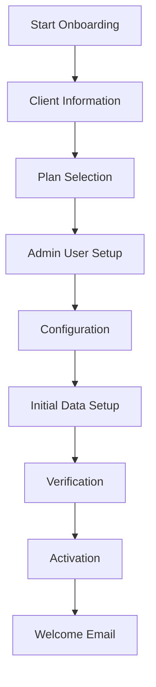

# Client Management System

Complete guide to client management in the MNFST-RAG multi-tenant SaaS platform, including client onboarding, configuration, and lifecycle management.

## 🎯 Overview

The client management system enables superadmins to manage multiple tenants (clients) within the MNFST-RAG platform. Each tenant represents a separate client organization with complete data isolation and dedicated resources.

## 🏢 Client Model

### Client (Tenant) Structure

```typescript
interface Client {
  id: string;                    // Unique client identifier
  name: string;                  // Client organization name
  slug: string;                  // URL-safe identifier
  status: 'active' | 'inactive' | 'suspended' | 'trial';
  plan: 'starter' | 'professional' | 'enterprise' | 'custom';
  settings: ClientSettings;
  billing: BillingInfo;
  usage: UsageMetrics;
  createdAt: string;              // ISO 8601 timestamp
  updatedAt: string;              // ISO 8601 timestamp
  trialEndsAt?: string;           // Trial period end date
}
```

### Client Settings

```typescript
interface ClientSettings {
  branding: {
    logo?: string;               // Client logo URL
    primaryColor: string;         // Brand primary color
    secondaryColor: string;       // Brand secondary color
    customCSS?: string;          // Custom CSS overrides
  };
  features: {
    maxUsers: number;            // Maximum allowed users
    maxDocuments: number;         // Maximum allowed documents
    maxStorageGB: number;        // Maximum storage in GB
    enableAPIAccess: boolean;     // API access enabled
    enableSSO: boolean;         // SSO integration enabled
    enableCustomDomain: boolean;  // Custom domain enabled
  };
  security: {
    require2FA: boolean;        // Require two-factor authentication
    passwordPolicy: PasswordPolicy;
    sessionTimeout: number;       // Session timeout in minutes
    ipWhitelist: string[];      // Allowed IP addresses
  };
  notifications: {
    emailNotifications: boolean;
    smsNotifications: boolean;
    webhookUrl?: string;         // Webhook for notifications
    alertThresholds: AlertThresholds;
  };
}
```

### Billing Information

```typescript
interface BillingInfo {
  planId: string;
  pricePerUser: number;
  pricePerGB: number;
  billingCycle: 'monthly' | 'yearly';
  nextBillingDate: string;
  paymentMethod: {
    type: 'card' | 'bank' | 'invoice';
    last4?: string;             // Last 4 digits of card
    expiryDate?: string;        // Card expiry date
  };
  usage: {
    currentUsers: number;
    currentStorageGB: number;
    overageCharges: number;
  };
}
```

## 🚀 Client Onboarding

### Onboarding Workflow



### Step 1: Client Information Collection

#### Required Information
```typescript
interface ClientOnboardingRequest {
  organization: {
    name: string;               // Legal organization name
    displayName: string;         // Display name
    industry: string;            // Industry sector
    size: '1-10' | '11-50' | '51-200' | '201-1000' | '1000+';
    website?: string;            // Company website
    description?: string;         // Company description
  };
  contact: {
    firstName: string;
    lastName: string;
    email: string;
    phone?: string;
    role: string;
  };
  address: {
    street: string;
    city: string;
    state: string;
    country: string;
    postalCode: string;
  };
  technical: {
    domain?: string;            // Custom domain (if applicable)
    existingUsers: number;       // Expected number of users
    integrationNeeds: string[];  // Integration requirements
  };
}
```

#### Validation Rules
```typescript
const validationRules = {
  organization: {
    name: {
      required: true,
      minLength: 2,
      maxLength: 255,
      pattern: /^[a-zA-Z0-9\s\-&.,']+$/
    },
    displayName: {
      required: true,
      minLength: 2,
      maxLength: 100
    },
    industry: {
      required: true,
      enum: ['technology', 'healthcare', 'finance', 'education', 'government', 'other']
    }
  },
  contact: {
    email: {
      required: true,
      format: 'email',
      unique: true
    },
    phone: {
      format: 'phone',
      required: false
    }
  }
};
```

### Step 2: Plan Selection

#### Available Plans

```typescript
interface Plan {
  id: string;
  name: string;
  description: string;
  pricing: {
    monthly: number;
    yearly: number;
    currency: string;
  };
  limits: {
    users: number;
    storageGB: number;
    documents: number;
    apiCalls: number;
  };
  features: {
    sso: boolean;
    customDomain: boolean;
    prioritySupport: boolean;
    advancedAnalytics: boolean;
    customIntegrations: boolean;
  };
  trial: {
    enabled: boolean;
    duration: number;        // Trial period in days
  };
}
```

#### Plan Comparison

| Feature | Starter | Professional | Enterprise |
|---------|---------|--------------|------------|
| **Users** | 5 | 50 | Unlimited |
| **Storage** | 5 GB | 100 GB | 1 TB+ |
| **Documents** | 100 | 5,000 | Unlimited |
| **SSO** | ❌ | ✅ | ✅ |
| **Custom Domain** | ❌ | ✅ | ✅ |
| **Priority Support** | ❌ | ✅ | ✅ |
| **API Access** | Limited | Full | Full |
| **Custom Integrations** | ❌ | ✅ | ✅ |

### Step 3: Admin User Setup

#### Admin Account Creation

```typescript
interface AdminUserSetup {
  credentials: {
    email: string;
    temporaryPassword: string;
    mustChangePassword: boolean;
  };
  profile: {
    firstName: string;
    lastName: string;
    role: 'tenant_admin';
    permissions: string[];
  };
  security: {
    require2FASetup: boolean;
    sendWelcomeEmail: boolean;
    passwordExpiry: number;    // Days until password expires
  };
}
```

#### Welcome Email Template

```html
<!DOCTYPE html>
<html>
<head>
    <meta charset="UTF-8">
    <title>Welcome to MNFST-RAG</title>
</head>
<body>
    <div style="font-family: Arial, sans-serif; max-width: 600px; margin: 0 auto;">
        <h1 style="color: #3b82f6;">Welcome to MNFST-RAG!</h1>
        <p>Hi {{firstName}},</p>
        <p>Your organization <strong>{{organizationName}}</strong> has been successfully set up on MNFST-RAG.</p>
        
        <div style="background: #f3f4f6; padding: 20px; border-radius: 8px; margin: 20px 0;">
            <h2>Your Login Details:</h2>
            <p><strong>Email:</strong> {{email}}</p>
            <p><strong>Temporary Password:</strong> {{temporaryPassword}}</p>
            <p><strong>Login URL:</strong> <a href="{{loginUrl}}">{{loginUrl}}</a></p>
            <p><strong>Important:</strong> You will be required to change your password on first login.</p>
        </div>
        
        <div style="background: #e5e7eb; padding: 20px; border-radius: 8px; margin: 20px 0;">
            <h2>Getting Started:</h2>
            <ol>
                <li>Log in with your credentials</li>
                <li>Change your temporary password</li>
                <li>Set up two-factor authentication</li>
                <li>Add your team members</li>
                <li>Upload your first documents</li>
            </ol>
        </div>
        
        <p>Need help? Contact our support team at <a href="mailto:support@ragchat.com">support@ragchat.com</a></p>
        
        <footer style="margin-top: 40px; padding-top: 20px; border-top: 1px solid #e5e7eb; color: #6b7280;">
            <p>&copy; 2024 MNFST-RAG. All rights reserved.</p>
        </footer>
    </div>
</body>
</html>
```

## 🔧 Client Configuration

### Initial Configuration

#### Default Settings

```typescript
const defaultClientSettings: ClientSettings = {
  branding: {
    primaryColor: '#3b82f6',
    secondaryColor: '#6b7280',
  },
  features: {
    maxUsers: 5,
    maxDocuments: 100,
    maxStorageGB: 5,
    enableAPIAccess: false,
    enableSSO: false,
    enableCustomDomain: false,
  },
  security: {
    require2FA: false,
    passwordPolicy: {
      minLength: 8,
      requireUppercase: true,
      requireLowercase: true,
      requireNumbers: true,
      requireSpecialChars: false,
      expiryDays: 90
    },
    sessionTimeout: 480, // 8 hours
    ipWhitelist: [],
  },
  notifications: {
    emailNotifications: true,
    smsNotifications: false,
    alertThresholds: {
      storageUsage: 80,     // Alert at 80% storage usage
      userLimit: 90,       // Alert at 90% user limit
      documentLimit: 85,    // Alert at 85% document limit
    }
  }
};
```

#### Configuration API

```http
POST /api/v1/tenants/{tenantId}/configure
Authorization: Bearer <superadmin-token>
Content-Type: application/json
```

```typescript
interface ConfigureClientRequest {
  settings: Partial<ClientSettings>;
  applyToExistingUsers?: boolean;  // Apply new security settings to existing users
  notifyUsers?: boolean;          // Send notification about configuration changes
}
```

### Custom Branding

#### Brand Customization Options

```typescript
interface BrandingCustomization {
  logo: {
    file: File;                 // Logo image file
    maxSize: 2 * 1024 * 1024; // 2MB max
    allowedTypes: ['image/png', 'image/jpeg', 'image/svg+xml'];
  };
  colors: {
    primary: string;             // Hex color code
    secondary: string;           // Hex color code
    accent?: string;             // Optional accent color
  };
  customCSS: {
    file?: File;               // Custom CSS file
    maxSize: 50 * 1024;       // 50KB max
    validation: {
      noExternalResources: true;  // No external URLs allowed
      noInlineScripts: true;    // No inline scripts allowed
    };
  };
  domain: {
    customDomain?: string;       // Custom domain name
    verifyDNS: boolean;        // Verify DNS configuration
    sslCertificate?: File;      // SSL certificate file
  };
}
```

## 📊 Client Lifecycle Management

### Status Management

#### Client Status States

```typescript
type ClientStatus = 'active' | 'inactive' | 'suspended' | 'trial';

interface StatusTransition {
  from: ClientStatus;
  to: ClientStatus;
  reason: string;
  effectiveDate: string;
  notifyUsers: boolean;
  message?: string;
}
```

#### Status Transitions

| From | To | Allowed | Reason | Auto-Transition |
|-------|-----|----------|--------|-----------------|
| trial | active | ✅ | Trial completed successfully | ✅ |
| trial | inactive | ✅ | Trial expired, no payment | ✅ |
| trial | suspended | ✅ | Terms of service violation | ❌ |
| active | inactive | ✅ | Client request | ❌ |
| active | suspended | ✅ | Payment failure or violation | ❌ |
| suspended | active | ✅ | Issue resolved | ❌ |
| inactive | active | ✅ | Client reactivation | ❌ |

### Automated Status Management

```typescript
class ClientLifecycleManager {
  // Check trial expirations
  async checkTrialExpirations(): Promise<void> {
    const expiringTrials = await this.getTrialsExpiringIn(7); // 7 days
    
    for (const client of expiringTrials) {
      await this.sendTrialExpiryNotification(client);
      
      // Auto-transition expired trials
      if (client.trialEndsAt <= new Date()) {
        await this.transitionStatus(client.id, 'inactive', 'Trial expired');
      }
    }
  }
  
  // Check billing status
  async checkBillingStatus(): Promise<void> {
    const overdueClients = await this.getClientsWithOverduePayment();
    
    for (const client of overdueClients) {
      if (client.status === 'active') {
        await this.transitionStatus(client.id, 'suspended', 'Payment overdue');
      }
    }
  }
  
  // Check usage limits
  async checkUsageLimits(): Promise<void> {
    const clients = await this.getActiveClients();
    
    for (const client of clients) {
      const usage = await this.getClientUsage(client.id);
      
      if (usage.storagePercent > 95) {
        await this.sendUsageAlert(client, 'storage', usage.storagePercent);
      }
      
      if (usage.userPercent > 95) {
        await this.sendUsageAlert(client, 'users', usage.userPercent);
      }
    }
  }
}
```

## 📈 Usage Monitoring

### Usage Metrics

```typescript
interface UsageMetrics {
  users: {
    total: number;
    active: number;              // Active in last 30 days
    newThisMonth: number;
    byRole: {
      tenant_admin: number;
      user: number;
    };
  };
  storage: {
    totalGB: number;
    usedGB: number;
    availableGB: number;
    usagePercent: number;
    largestDocuments: Array<{
      name: string;
      size: number;
      uploadedAt: string;
    }>;
  };
  documents: {
    total: number;
    processed: number;
    uploadedThisMonth: number;
    byType: Record<string, number>;
  };
  sessions: {
    total: number;
    thisMonth: number;
    averageDuration: number;
    totalMessages: number;
  };
  api: {
    callsThisMonth: number;
    averageResponseTime: number;
    errorRate: number;
    topEndpoints: Array<{
      endpoint: string;
      calls: number;
    }>;
  };
}
```

### Usage Alerts

```typescript
interface UsageAlert {
  id: string;
  clientId: string;
  type: 'storage' | 'users' | 'documents' | 'api';
  severity: 'info' | 'warning' | 'critical';
  threshold: number;           // Percentage threshold
  currentValue: number;        // Current usage percentage
  message: string;
  createdAt: string;
  resolvedAt?: string;
}
```

## 🔒 Security & Compliance

### Client Data Isolation

#### Row-Level Security Policies

```sql
-- Ensure clients can only access their own data
CREATE POLICY client_data_isolation ON users
    FOR ALL TO authenticated
    USING (tenant_id = current_setting('app.current_tenant_id')::uuid);

CREATE POLICY client_data_isolation ON documents
    FOR ALL TO authenticated
    USING (tenant_id = current_setting('app.current_tenant_id')::uuid);

CREATE POLICY client_data_isolation ON chat_sessions
    FOR ALL TO authenticated
    USING (tenant_id = current_setting('app.current_tenant_id')::uuid);
```

#### Data Encryption

```typescript
interface EncryptionSettings {
  atRest: {
    enabled: boolean;
    algorithm: 'AES-256-GCM';
    keyRotation: 'quarterly' | 'monthly' | 'yearly';
  };
  inTransit: {
    enabled: boolean;
    tlsVersion: '1.3';
    cipherSuites: string[];
  };
  keyManagement: {
    provider: 'aws-kms' | 'azure-keyvault' | 'internal';
    rotationSchedule: string;
  };
}
```

### Compliance Features

```typescript
interface ComplianceFeatures {
  gdpr: {
    dataPortability: boolean;      // Export user data
    rightToErasure: boolean;     // Delete user data
    consentManagement: boolean;    // Manage consent
    dataProcessingRecords: boolean; // Track data processing
  };
  soc2: {
    accessControls: boolean;       // Role-based access
    encryption: boolean;         // Data encryption
    monitoring: boolean;         // System monitoring
    incidentResponse: boolean;    // Incident handling
  };
  hipaa: {
    auditLogging: boolean;       // Comprehensive audit logs
    userAuthentication: boolean;  // Strong authentication
    transmissionSecurity: boolean; // Secure data transmission
    dataIntegrity: boolean;      // Data integrity checks
  };
}
```

## 🚀 Client Management API

### Client Management Endpoints

```http
GET /api/v1/clients
Authorization: Bearer <superadmin-token>
```

#### Response

```typescript
interface GetClientsResponse {
  success: true;
  data: {
    clients: Client[];
    pagination: {
      page: number;
      limit: number;
      total: number;
      totalPages: number;
    };
  };
}
```

### Client Configuration Endpoints

```http
PUT /api/v1/clients/{clientId}/configuration
Authorization: Bearer <superadmin-token>
Content-Type: application/json
```

#### Request

```typescript
interface UpdateClientConfigurationRequest {
  settings: Partial<ClientSettings>;
  reason?: string;              // Reason for configuration change
  notifyUsers?: boolean;        // Send notification to client users
  effectiveDate?: string;       // When changes take effect
}
```

### Client Status Management

```http
POST /api/v1/clients/{clientId}/status
Authorization: Bearer <superadmin-token>
Content-Type: application/json
```

#### Request

```typescript
interface UpdateClientStatusRequest {
  status: ClientStatus;
  reason: string;
  effectiveDate?: string;       // Default: immediate
  notifyUsers?: boolean;
  message?: string;             // Custom message to users
}
```

## 📧 Client Communication

### Notification System

#### Email Templates

```typescript
interface EmailTemplate {
  id: string;
  name: string;
  subject: string;
  htmlContent: string;
  textContent: string;
  variables: string[];          // Template variables
  categories: ['welcome', 'billing', 'security', 'usage', 'maintenance'];
}
```

#### Notification Channels

```typescript
interface NotificationChannel {
  type: 'email' | 'sms' | 'inapp' | 'webhook';
  enabled: boolean;
  settings: {
    email?: {
      templateId: string;
      fromAddress: string;
      replyTo?: string;
    };
    sms?: {
      provider: 'twilio' | 'aws-sns' | 'custom';
      fromNumber: string;
    };
    webhook?: {
      url: string;
      secret: string;
      retryPolicy: 'exponential' | 'linear';
    };
  };
}
```

### Automated Communications

```typescript
class ClientCommunicationManager {
  // Trial expiry notifications
  async sendTrialExpiryReminder(client: Client, daysUntilExpiry: number): Promise<void> {
    const template = await this.getEmailTemplate('trial_expiry');
    const variables = {
      clientName: client.name,
      daysUntilExpiry,
      expiryDate: client.trialEndsAt,
      upgradeUrl: `${this.baseUrl}/upgrade/${client.id}`,
      loginUrl: `${this.baseUrl}/login`
    };
    
    await this.sendEmail(client.contact.email, template, variables);
  }
  
  // Usage alerts
  async sendUsageAlert(client: Client, alert: UsageAlert): Promise<void> {
    const template = await this.getEmailTemplate('usage_alert');
    const variables = {
      clientName: client.name,
      alertType: alert.type,
      threshold: alert.threshold,
      currentValue: alert.currentValue,
      adminUrl: `${this.baseUrl}/admin/${client.id}`
    };
    
    await this.sendEmail(client.contact.email, template, variables);
  }
  
  // Maintenance notifications
  async sendMaintenanceNotification(
    clients: Client[], 
    maintenance: MaintenanceWindow
  ): Promise<void> {
    const template = await this.getEmailTemplate('maintenance');
    
    for (const client of clients) {
      const variables = {
        clientName: client.name,
        startTime: maintenance.startTime,
        endTime: maintenance.endTime,
        impact: maintenance.impact,
        statusUrl: `${this.baseUrl}/status/${client.id}`
      };
      
      await this.sendEmail(client.contact.email, template, variables);
    }
  }
}
```

## 📊 Analytics & Reporting

### Client Analytics

```typescript
interface ClientAnalytics {
  client: {
    id: string;
    name: string;
    plan: string;
    status: string;
    createdAt: string;
  };
  usage: {
    users: {
      total: number;
      active: number;
      growth: number;           // Month over month growth
    };
    storage: {
      usedGB: number;
      growth: number;           // Month over month growth
    };
    documents: {
      total: number;
      processed: number;
      uploadRate: number;       // Documents per day
    };
    sessions: {
      total: number;
      averageDuration: number;
      messagesPerSession: number;
    };
  };
  engagement: {
    loginFrequency: number;      // Average days between logins
    featureUsage: Record<string, number>;  // Feature usage counts
    sessionDuration: {
      p50: number;
      p95: number;
      average: number;
    };
  };
  financial: {
    mrr: number;              // Monthly recurring revenue
    arr: number;              // Annual recurring revenue
    ltv: number;              // Lifetime value
    churnRate: number;         // Customer churn rate
  };
}
```

### Reporting Dashboard

```typescript
interface ClientReportingDashboard {
  overview: {
    totalClients: number;
    activeClients: number;
    trialClients: number;
    newClientsThisMonth: number;
    churnedClientsThisMonth: number;
  };
  topPerformers: {
    byUsage: Array<{
      clientId: string;
      clientName: string;
      usageScore: number;
    }>;
    byGrowth: Array<{
      clientId: string;
      clientName: string;
      growthRate: number;
    }>;
    byRevenue: Array<{
      clientId: string;
      clientName: string;
      mrr: number;
    }>;
  };
  health: {
    atRiskClients: Array<{
      clientId: string;
      clientName: string;
      riskFactors: string[];
    }>;
    usageAlerts: UsageAlert[];
    systemHealth: {
      uptime: number;
      responseTime: number;
      errorRate: number;
    };
  };
}
```

---

**Related Documentation**:
- [Database Schema](./database-schema.md) - Client data structure
- [Tenant Management Endpoints](./tenant-management-endpoints.md) - Tenant API endpoints
- [Authentication System](./authentication-authorization-system.md) - Client authentication
- [API Specification](./api-specification.md) - Complete API reference