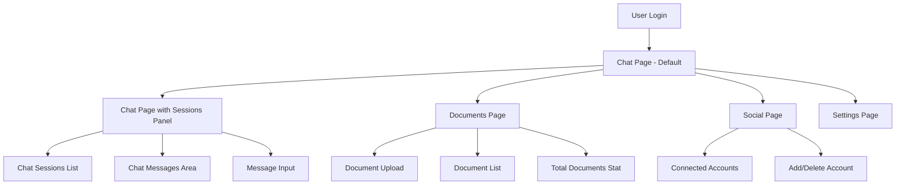
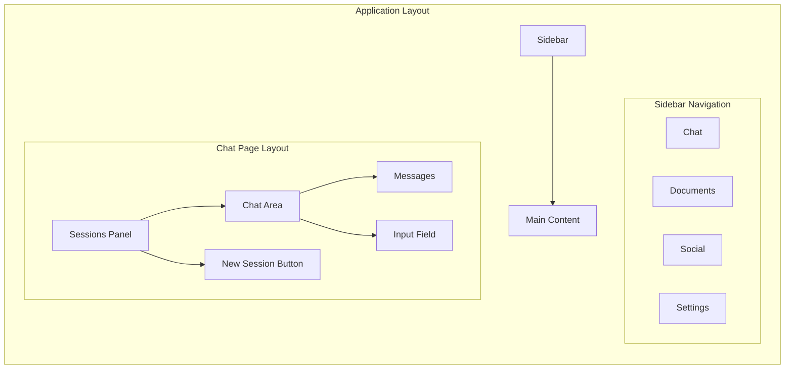
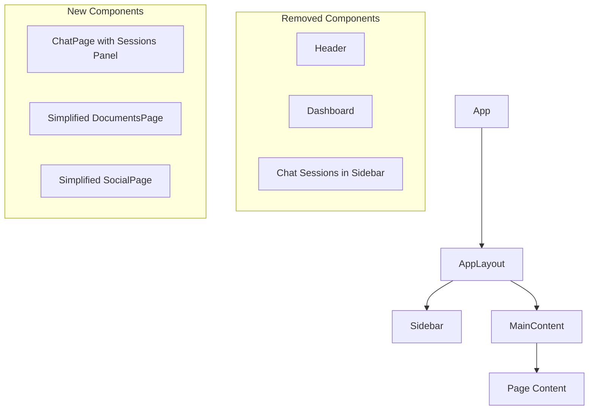

# Application Layout Diagrams

## New Application Flow



## New Layout Structure



## Component Hierarchy Changes



## Page Navigation Flow

```mermaid
stateDiagram-v2
    [*] --> Chat: Login Success
    Chat --> Documents: Navigate
    Chat --> Social: Navigate
    Chat --> Settings: Navigate
    
    Documents --> Chat: Navigate
    Social --> Chat: Navigate
    Settings --> Chat: Navigate
    
    Chat --> [*]: Logout
    Documents --> [*]: Logout
    Social --> [*]: Logout
    Settings --> [*]: Logout